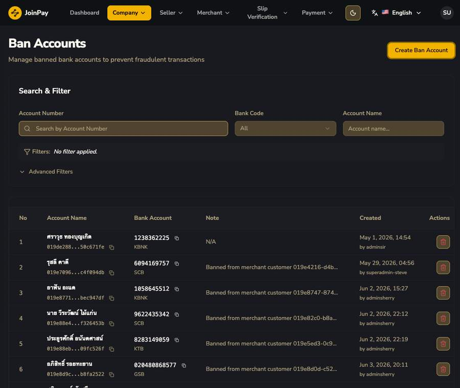

# Ban Accounts

!!! danger "กลไก Anti-Fraud ระดับ Platform (ไม่มีในเอกสาร OpenAPI เดิม)"
    นี่คือ ban ระดับ **เลขบัญชีธนาคาร** ไม่ใช่ ban ระดับ `customer` — และเป็น ban ที่มีผล **ข้าม Merchant ทุกราย** ในระบบ (platform-wide) ไม่ใช่แค่ per-merchant
    แต่ละ record ผูก note `"Banned from merchant customer <customerUuid>"` ซึ่งเป็น reference กลับไปยัง customer ต้นเหตุที่ทำให้เกิดการ ban นี้

| ฟิลด์ | รายละเอียด |
|---|---|
| Account Name / Bank Account | ชื่อ+เลขบัญชีที่ถูกแบน |
| Note | เหตุผล/ที่มาของการแบน (มักอ้างอิง customerUuid) |
| Created ... by [admin] | Audit trail ว่าใครสั่งแบน |

## Flow การเกิด Ban ที่สมบูรณ์ (สรุปจากหลายหน้าจอ)

1. **Admin** เห็น customer มีพฤติกรรมทุจริต (เช่น สลิปปลอม) ในหน้า [Merchant Customers](../merchant/customers.md)
2. **Admin** กดปุ่ม 🚫 (ban) ที่แถวของ customer นั้น
3. **ระบบ** สร้าง record ใหม่ใน Ban Accounts โดยเอาเลขบัญชีธนาคารของ customer นั้นขึ้นบัญชีดำ พร้อม note อ้างอิง customerUuid
4. **ผลลัพธ์**: เลขบัญชีนั้นถูกบล็อกที่ **ทุก Merchant** ในระบบ ไม่ใช่แค่ merchant ที่รายงานปัญหา
