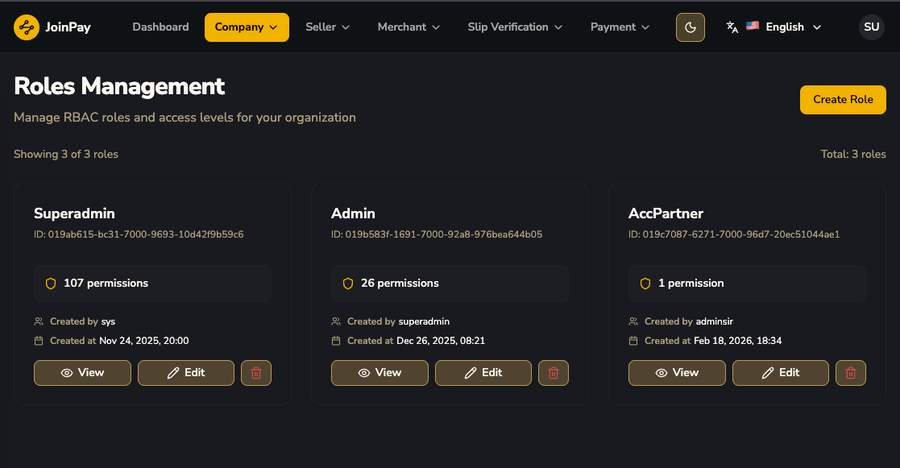
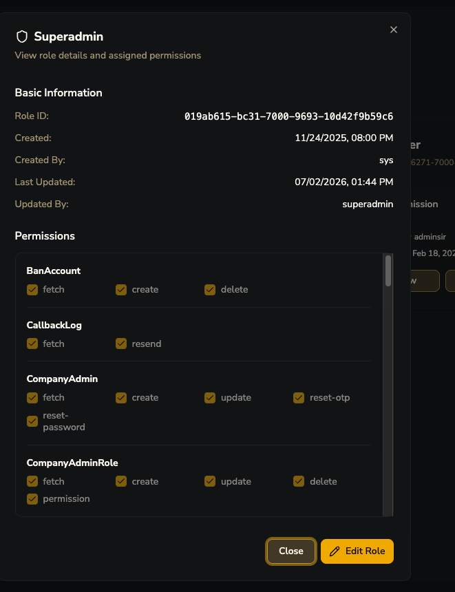
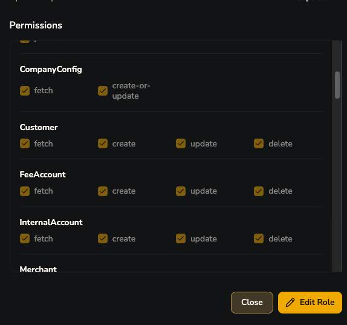
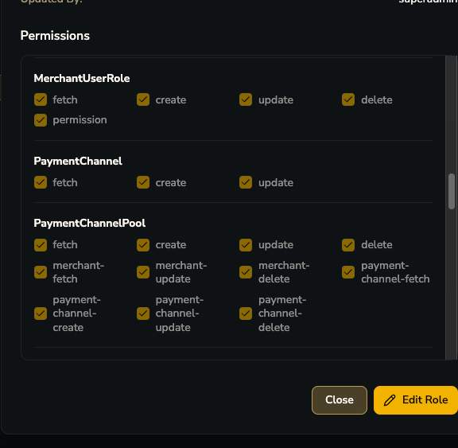
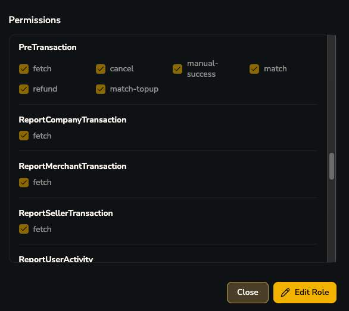
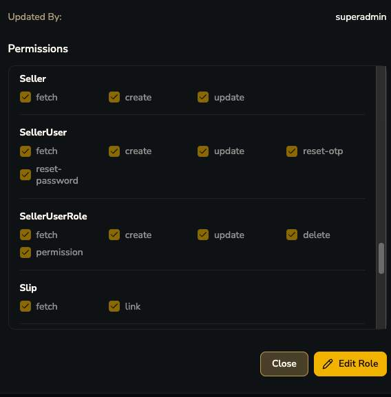

# Company Roles

ระบบ Permission แบบ Role-Based Access Control (RBAC) เต็มรูปแบบ พบ 3 roles ตัวอย่างจริง: **Superadmin** (107 permissions), **Admin** (26 permissions), **AccPartner** (1 permission) — แต่ละ role สร้างเองได้ผ่านปุ่ม "Create Role" โดยเลือก checkbox permission ทีละ module

=== "View Role (1/6)"
    
=== "View Role (2/6)"
    
=== "View Role (3/6)"
    ")
=== "View Role (4/6)"
    
=== "View Role (5/6)"
    
=== "View Role (6/6)"
    

## รายชื่อ Permission Module ทั้งหมดที่พบ (ระดับ Company)

| Module | Actions ที่พบ | ความหมาย / ข้อสังเกต |
|---|---|---|
| `BanAccount` | fetch, create, delete | จัดการรายชื่อบัญชีที่ถูกแบน |
| `CallbackLog` | fetch, **resend** | Admin สั่ง resend webhook ให้ Merchant ได้เองถ้าครั้งแรกพลาด |
| `CompanyAdmin` / `CompanyAdminRole` | fetch, create, update, delete, permission, reset-otp, reset-password | จัดการ Company Users/Roles เอง |
| `CompanyConfig` | fetch, create-or-update | แก้ค่า Payment Config ระดับบริษัท |
| `Customer` | fetch, create, update, delete | จัดการ End User ของทุก merchant |
| `FeeAccount` / `InternalAccount` | fetch, create, update, delete | จัดการบัญชีธนาคารรับ fee / บัญชีภายใน |
| `Merchant` | fetch, create, update, **reset-api-key**, collect-fee-request, settle-request, **unhold, hold**, seller-mdr-fetch/replace/update | ควบคุม merchant เต็มรูปแบบ รวม hold/unhold wallet และสั่ง settle |
| `MerchantAccount` / `MerchantUser` / `MerchantUserRole` | fetch, create, update, delete, reset-otp, reset-password | จัดการบัญชี/user ของ merchant แทนได้ |
| `PaymentChannel` / `PaymentChannelPool` | fetch, create, update, delete, merchant-fetch/update/delete, payment-channel-* | บริหาร Payment Channel และ Pool |
| `PreTransaction` | fetch, cancel, **manual-success**, **match**, **refund**, **match-topup** | หัวใจของ manual reconcile |
| `Report*` | fetch | ReportCompanyTransaction, ReportMerchantTransaction, ReportSellerTransaction, ReportUserActivity |
| `Seller` / `SellerUser` / `SellerUserRole` | fetch, create, update, delete, reset-otp/password, permission | จัดการ Seller และ user ของ seller |
| `SellerMdrTemplate` | fetch, create, update, delete | จัดการ MDR template |
| `Slip` / `SlipQRVerifier` | fetch, link, fetch-secret, update-secret | verify-slip พึ่งพา 3rd-party provider |
| `Transaction` / `TransactionStat` | fetch | ดู transaction/สถิติ |
| `UserActivity` | fetch | audit log กิจกรรมผู้ใช้ |
| `WalletCompany` / `WalletMerchant` | fetch | ดู wallet balance |
