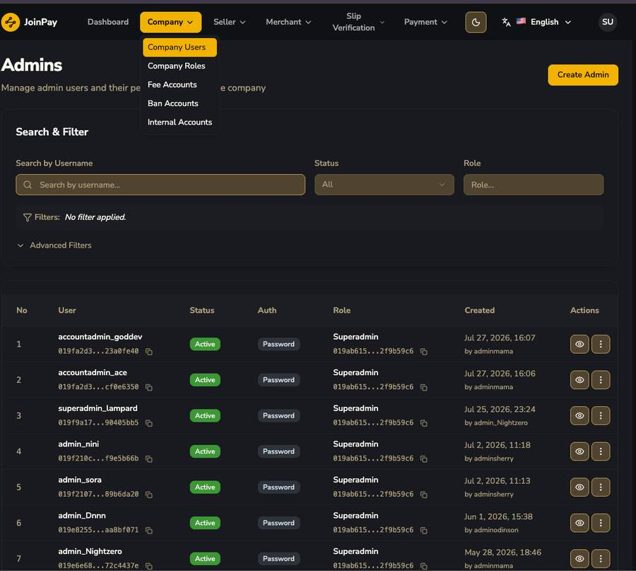

# Company Users

จัดการ "แอดมิน" ที่มีสิทธิ์เข้า Console นี้เอง (คนละกลุ่มกับ Merchant User หรือ Seller User) แต่ละคนมี username, role (เช่น Superadmin), และ audit trail ว่าใครเป็นคนสร้าง

| ฟิลด์ | รายละเอียด |
|---|---|
| User / Auth | username และวิธียืนยันตัวตน (เท่าที่เห็นมีแค่ "Password") |
| Status | `Active` เท่าที่เห็นในตัวอย่าง — คาดว่ามี Inactive ด้วย |
| Role | ผูกกับ Company Role ที่สร้างไว้ |
| Created ... by [ผู้สร้าง] | Audit trail เต็มรูปแบบ |
| ปุ่ม Create Admin | สร้าง admin user ใหม่ |
