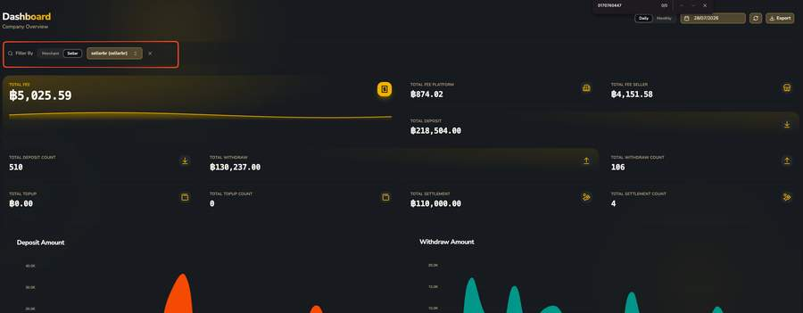

# Dashboard

หน้าแรกที่เห็นเมื่อ login เข้า Console — ภาพรวมตัวเลขทั้งบริษัท

 — Company Overview")

## องค์ประกอบของหน้า Dashboard

| ฟิลด์ / ปุ่ม | รายละเอียด |
|---|---|
| Daily / Monthly toggle | สลับมุมมองกราฟ/ตัวเลขเป็นรายวันหรือรายเดือน |
| ตัวเลือกวันที่ | เลือกวันที่อ้างอิงสำหรับสรุปข้อมูล |
| ปุ่ม 🔄 Refresh | ดึงข้อมูลล่าสุดใหม่ |
| ปุ่ม Export | ส่งออกข้อมูลสรุปเป็นไฟล์ (ยังไม่ทราบฟอร์แมตแน่ชัด) |
| Filter By: Merchant / Seller | สลับโหมดกรองข้อมูลเจาะจงเป็น Merchant หรือ Seller รายตัว พร้อมช่องค้นหาชื่อ |
| 🌙 Dark/Light, 🌐 ภาษา | ปรับธีมและเปลี่ยนภาษาของ Console |

## Metric Cards (แถวบน)

| Card | ความหมาย |
|---|---|
| `TOTAL FEE` | ผลรวมค่าธรรมเนียมทั้งหมดที่เก็บได้ในช่วงเวลาที่เลือก |
| `TOTAL FEE PLATFORM` | ค่าธรรมเนียมเฉพาะส่วน Platform Fee |
| `TOTAL FEE SELLER` | ค่าธรรมเนียมเฉพาะส่วน Seller Fee — มีค่าจริงเมื่อกรองดูเฉพาะ Seller |
| `TOTAL DEPOSIT` / `COUNT` | ยอดเงินฝากรวม และจำนวนครั้ง |
| `TOTAL WITHDRAW` / `COUNT` | ยอดถอนรวม และจำนวนครั้ง |
| `TOTAL TOPUP` / `COUNT` | ยอด Merchant เติมเงินเข้าระบบ และจำนวนครั้ง |
| `TOTAL SETTLEMENT` / `COUNT` | ยอดที่โอนคืนให้ Merchant และจำนวนครั้ง |

## กราฟด้านล่าง

`Deposit Amount` และ `Withdraw Amount` — กราฟแท่ง/พื้นที่แสดงยอดเงินรายวันในช่วงเวลาที่เลือก แยกกันเป็น 2 กราฟ

!!! tip "ข้อสังเกตสำคัญจากหน้านี้"
    เมื่อ filter เป็น Seller เฉพาะราย ตัวเลข `TOTAL FEE SELLER` จะไม่เป็นศูนย์ (พบตัวอย่างจริง ฿4,151.58) — ยืนยันว่า **Seller Fee เป็นค่าที่ track แยกออกมาจริง** ในระบบ ไม่ใช่แค่ผลรวมสมมติ
