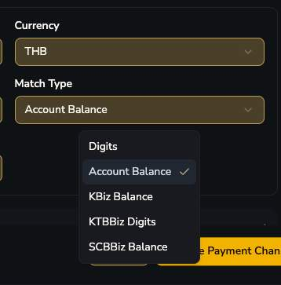
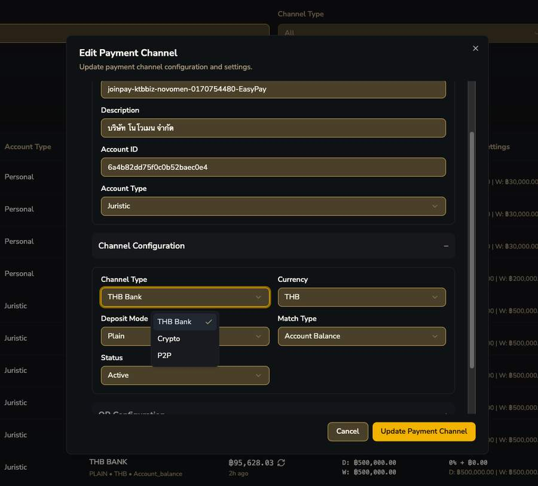
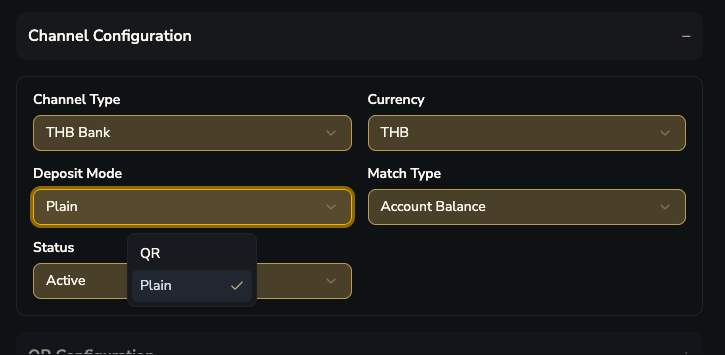
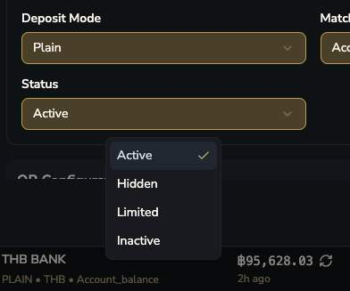
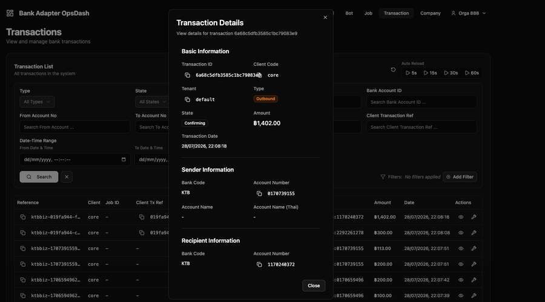
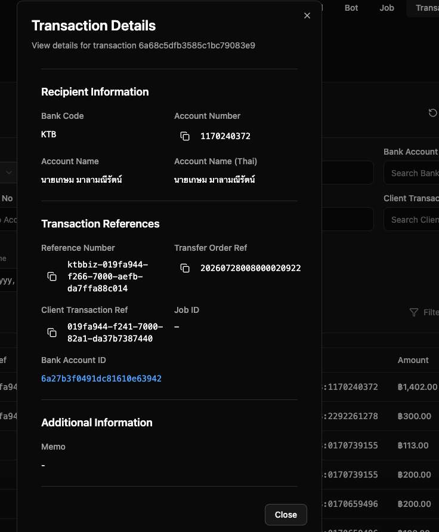

# Deep-dive: Match Type

หน้าพิเศษที่รวบรวมการวิเคราะห์เจาะลึกเรื่อง Digits vs Balance vs [Bank]Biz variants จากหลักฐานหลายชิ้น

!!! question "สถานะของหน้านี้: เป็นการวิเคราะห์ ไม่ใช่คำยืนยันจากทีมพัฒนา"
    เนื้อหาในหน้านี้ทั้งหมดมาจากการอนุมานจากหลักฐาน (dropdown ที่เห็นใน Channel Config + raw data ตัวอย่างจาก Bank Adapter OpsDash) — สอดคล้องกันดีแต่ยัง **ไม่ได้รับการยืนยันจากทีมพัฒนาโดยตรง**

## หลักฐานที่ 1 — Match Type dropdown มี 5 ตัวเลือก



รูปแบบชื่อคือ `[ธนาคาร(optional)][Biz(optional)]` + `[Digits|Balance]` — บ่งชี้ว่ามี 2 มิติซ้อนกัน ไม่ใช่มิติเดียว

=== "Channel Type"
    
=== "Deposit Mode"
    
=== "Status"
    

## มิติที่ 1 — วิธี match (Digits vs Balance)

| วิธี | คำอธิบาย |
|---|---|
| `Digits` | match ด้วยเลขทศนิยม unique amount ที่ธนาคารรายงานมาตรงๆ ใน field amount (เช่น 113.47) |
| `Balance` | match โดยคำนวณส่วนต่างยอดคงเหลือ (ledgerBalance ก่อน vs หลัง) แทนที่จะเชื่อ field "amount" ตรงๆ |

## มิติที่ 2 — ทำไมต้องมีทั้งสองแบบ

ธนาคารแต่ละเจ้ามี Business Banking API/adapter คนละตัว (K-BIZ ของ Kasikorn, Krungthai BUSINESS ของ KTB, SCB Business ของ SCB) ซึ่งให้ข้อมูลคุณภาพไม่เท่ากัน:

| Match Type | สมมติฐาน |
|---|---|
| `KTBiz Digits` | Krungthai Biz API รายงานยอดเงินทศนิยมแม่นยำ/เชื่อถือได้ → ใช้ Digits ได้ตรงๆ |
| `KBiz Balance` / `SCBBiz Balance` | K-BIZ / SCB Business API รายงาน amount ไม่น่าเชื่อถือพอ (ปัดเศษ/ตัดทศนิยม) → ต้องคำนวณจากส่วนต่าง balance แทน |
| `Digits` / `Account Balance` | generic fallback สำหรับธนาคารที่ไม่มี dedicated Biz adapter เฉพาะทาง |

## หลักฐานที่ 2 — Raw Data จาก Bank Adapter OpsDash (ฝั่ง Outbound/Withdraw)



=== "Recipient Info"
    
=== "Raw Data"
     — เห็น masking pattern")

!!! tip "สังเกตสำคัญจาก Raw Data ฝั่ง Withdraw (KTB Biz)"
    - บัญชี **ของตัวเอง** (`fromAccountNo`, `masterAccountNo`) ถูก mask เป็น `"XXX-X-XX915-5"` แต่บัญชี **ผู้รับ** (`toAccountNo`) โชว์เต็ม — mask เกิดกับบัญชีเจ้าของ session เอง ไม่ใช่บัญชีคู่กรณี
    - field `accountLevel: "MA"` และ `masterAccountNo`, `isMasterAccount: false` → บัญชีที่ใช้จริงเป็น **sub-account ภายใต้ Master Account ของ KTB Biz** — อาจเป็นกลไกเบื้องหลังที่ทำให้ Payment Pool รวมหลาย Channel เข้าด้วยกันได้ง่าย (ยังไม่ยืนยัน)
    - มี field `payerAvailableBalance: 403012.45` ให้ใช้อยู่แล้วในทุก call

## หลักฐานที่ 3 — Raw Data ฝั่ง Inbound/Deposit (หลักฐานที่หนักแน่นที่สุด)

```json
{"transactionType":"Deposit", "deposit":113, "ledgerBalance":404012.45, "transactionComment":"030-020442061840", ...}
```

!!! danger "จุดที่สำคัญที่สุด — field 'deposit' เป็นเลขจำนวนเต็ม ไม่มีทศนิยมเลย!"
    `"deposit": 113` — ไม่ใช่ 113.47 ทั้งที่ pre-transaction อาจตั้งไว้เป็น 113.47 (unique amount แบบทศนิยม)

    ถ้าระบบใช้ **Digits mode** (เชื่อค่า deposit ตรงๆ) จะ **match ไม่ได้เลย** เพราะ 113 ≠ 113.47 → กลายเป็น unknown_deposit ทั้งที่โอนถูกต้องทุกอย่าง

    แต่ `ledgerBalance` มีทศนิยมครบ (404012.45) → ระบบที่ใช้ **Balance mode** คำนวณ ledgerBalance ปัจจุบัน − ledgerBalance ก่อนหน้า เพื่อกู้ทศนิยมที่แท้จริงกลับมา

!!! tip "สรุปสมมติฐานที่มั่นใจขึ้น (แต่ยังไม่ 100%)"
    **Digits** = เชื่อค่า amount ที่ธนาคารรายงานตรงๆ (ใช้ได้กับธนาคารที่ report ทศนิยมแม่นยำ)

    **Balance** = คำนวณส่วนต่าง ledgerBalance เอง เพราะธนาคารบางเจ้าตัดทศนิยมทิ้งใน field amount

    นอกจากนี้ raw data inbound **ไม่มี field ระบุบัญชี/ธนาคารผู้โอนเลย** มีแค่ `transactionComment` ที่ดูเหมือนโค้ดอ้างอิงมากกว่าเลขบัญชีที่อ่านได้ตรงๆ → สนับสนุนว่า fallback แบบ senderAccountNo อาจใช้ไม่ได้กับธนาคาร/channel บางประเภท

## ตัวอย่างสลิปจริงที่ใช้ประกอบการวิเคราะห์

=== "สลิป K BIZ"
    ")
=== "สลิป K+"
    

!!! question "คำถามค้างของหน้านี้"
    1. Match Type "Balance" คำนวณส่วนต่างยังไงกันแน่ (polling ทุกกี่วินาที เทียบ balance ก่อน-หลังแบบไหน)?
    2. เลขบัญชี mask ที่เห็นในสลิปที่ End User ได้รับ กระทบข้อมูลจริงที่ Bank Adapter backend ได้รับไหม?
    3. Master Account structure (`accountLevel: MA`) เกี่ยวข้องกับการรวม Payment Channel เป็น Pool จริงไหม?
