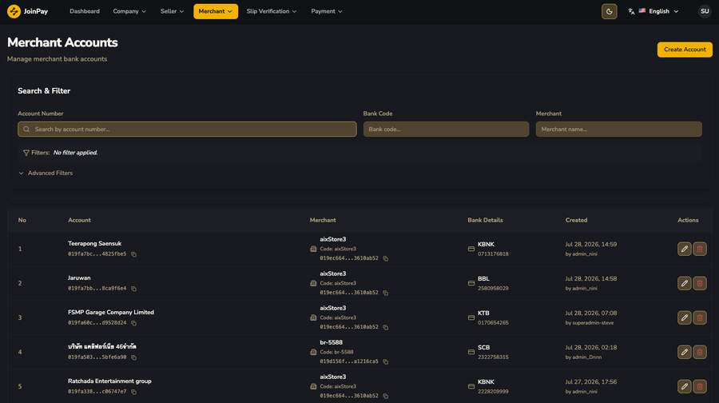
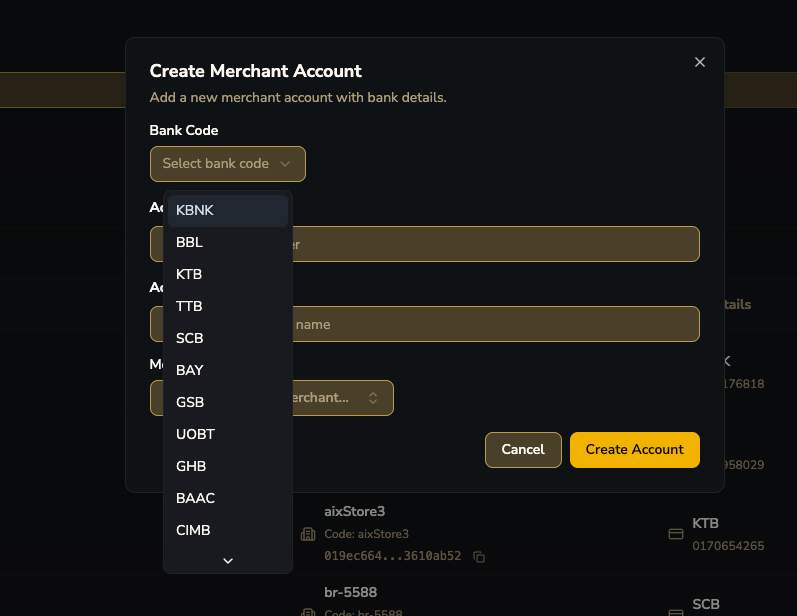
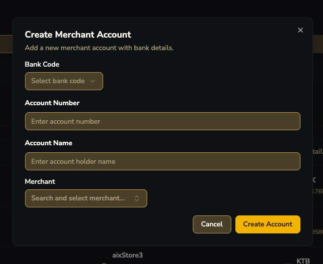

# Merchant Accounts

!!! question "คำถามค้าง — ความสัมพันธ์กับ Payment Pool"
    merchant เดียว (aixStore3) มีหลายบัญชี (Teerapong Saensuk/KBNK, Jaruwan/BBL, FSMP Garage Company Limited/KTB, Ratchada Entertainment group/KBNK) — ชื่อบัญชีแต่ละอันเป็นคนละนิติบุคคลกัน

    **ยังไม่ชัดเจนว่า:** นี่คือ pool บัญชีรับเงินฝากที่ merchant ใช้หมุนเวียนเอง หรือเป็นบัญชีของ sub-vendor ในเครือ merchant หรือเป็นคนละ layer จาก [Payment Channel/Pool](../payment/pools.md) โดยสิ้นเชิง — ควรถามผู้รู้ระบบยืนยัน เพราะกระทบความเข้าใจเรื่อง deposit flow โดยตรง

## ฟอร์ม Create Merchant Account

