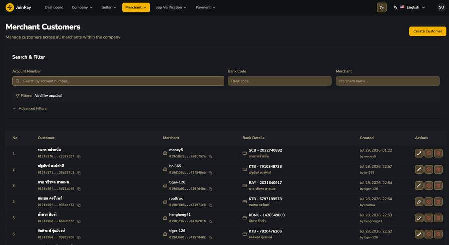
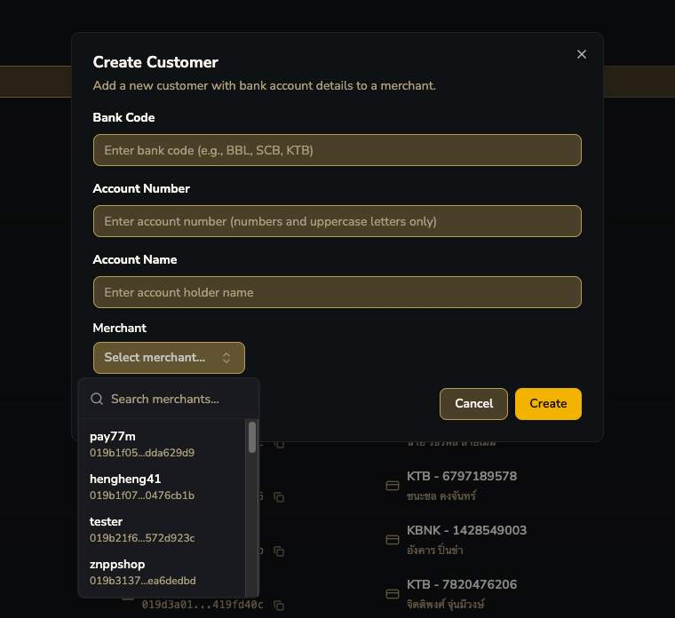

# Merchant Customers

นี่คือหน้าที่ Admin เห็น entity "Customer" (End User) จาก **ทุก merchant รวมกัน** — ตรงกับ entity ที่สร้างผ่าน `PUT /customer` ใน OpenAPI spec คอลัมน์ "Created ... by [merchant code]" ยืนยันว่า record ถูกสร้างผ่าน API call จากตัว Merchant เอง

!!! danger "ปุ่ม 🚫 Ban — จุดกำเนิดของ Ban Accounts"
    ปุ่มรูปวงกลมขีดฆ่าระหว่าง Edit กับ Delete คือปุ่ม "Ban บัญชีของ customer นี้" — กดแล้วระบบจะสร้าง record ใน [Company → Ban Accounts](../company/ban-accounts.md) โดยอัตโนมัติ พร้อม note อ้างอิงกลับมาที่ customerUuid นี้

ฟิลด์ตรงกับ `PUT /customer` request body: Bank Code, Account Number, Account Name + ต้องเลือก Merchant ที่จะผูกเข้าไป (Admin สร้างแทน merchant ได้ในกรณีจำเป็น)
