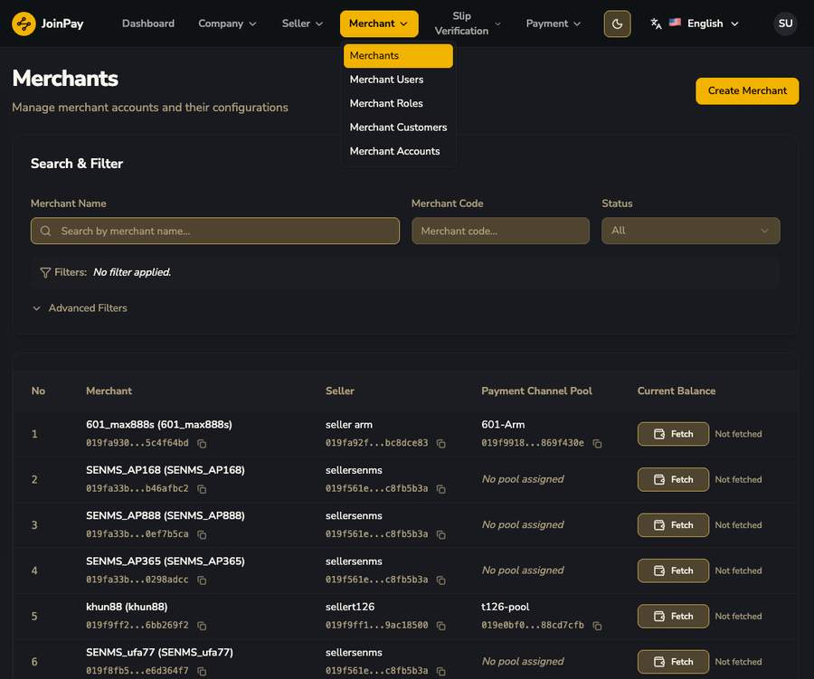
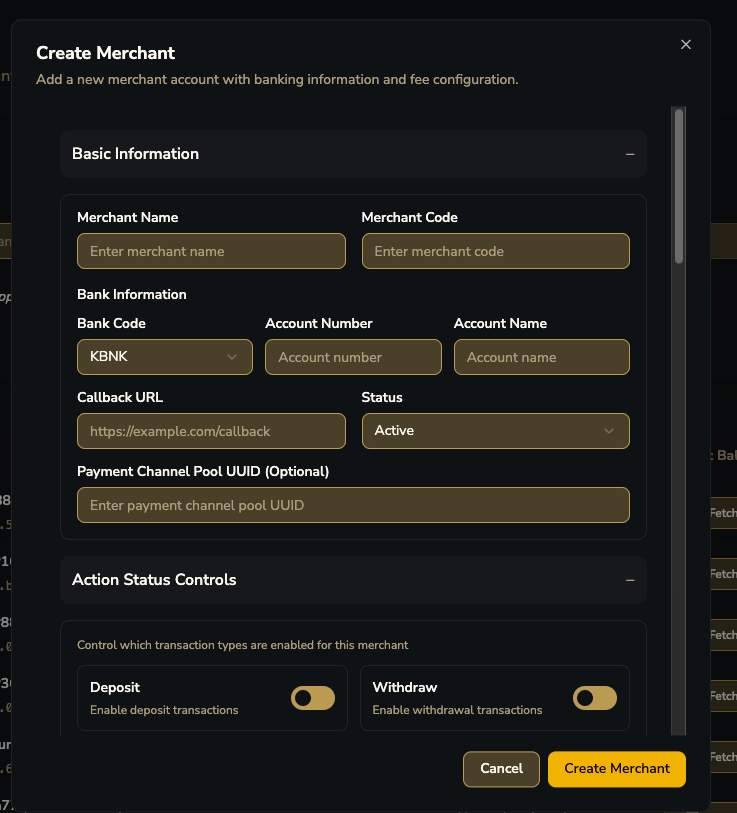
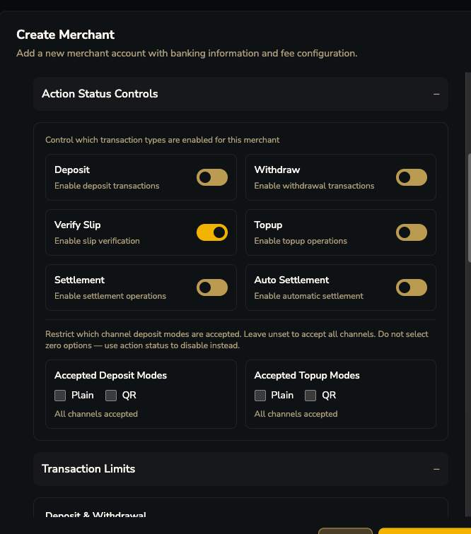
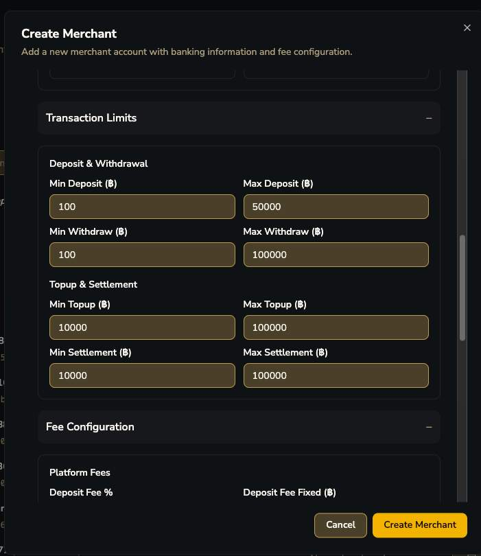
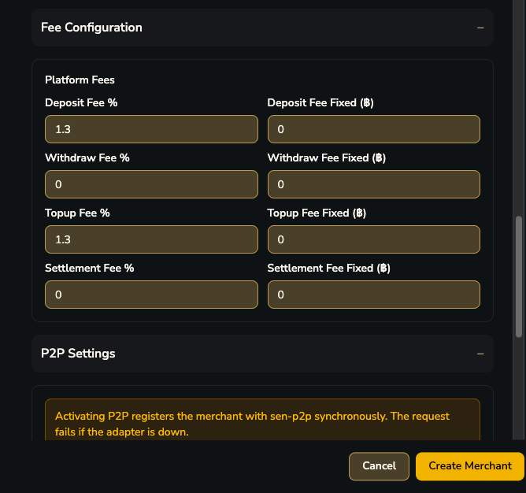
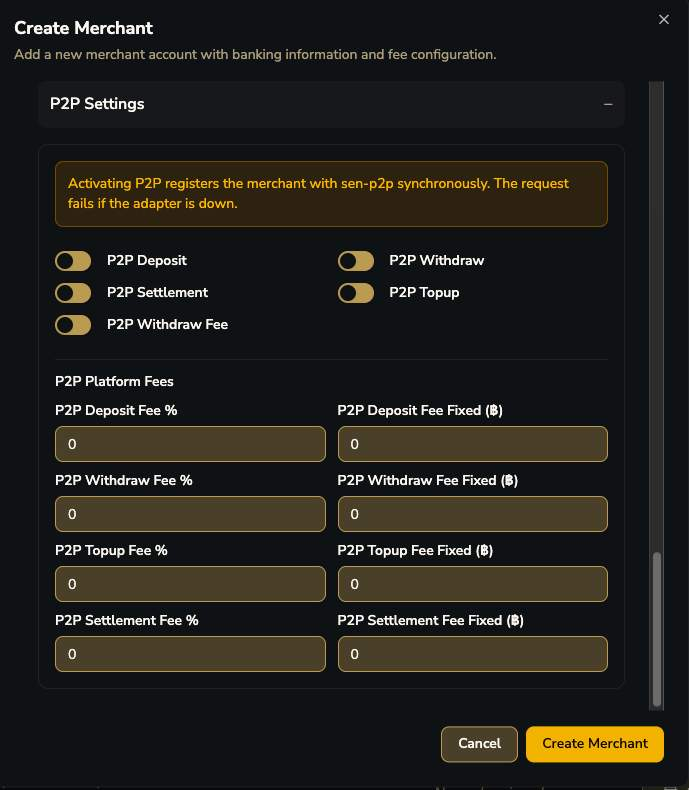
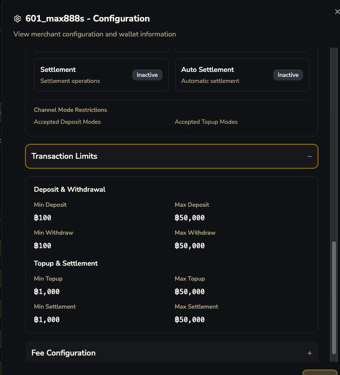
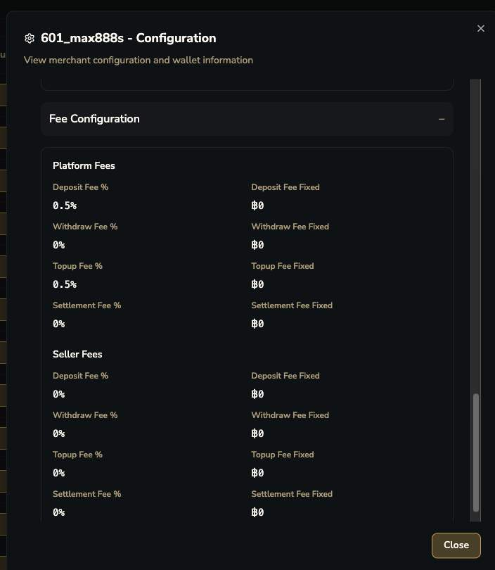

# Merchants

| คอลัมน์ | ความหมาย |
|---|---|
| Merchant | ชื่อ + code |
| Seller | seller ต้นสังกัดของ merchant นี้ |
| Payment Channel Pool | pool ที่ merchant นี้ถูก assign ให้ใช้ (บางรายยัง "No pool assigned") |
| Current Balance | ต้องกดปุ่ม "Fetch" ถึงจะดึงยอดจริงมาแสดง |

## ฟอร์ม Create Merchant — ฟอร์มที่ซับซ้อนที่สุดในระบบ

แบ่งเป็น 5 ส่วนใหญ่: Basic Information, Action Status Controls, Transaction Limits, Fee Configuration, P2P Settings

### ① Basic Information

| ฟิลด์ | รายละเอียด |
|---|---|
| Merchant Name / Code | ชื่อและรหัสของ merchant |
| Bank Code / Account Number / Account Name | บัญชี settlement หลักของ merchant |
| Callback URL | endpoint ที่ระบบจะยิง webhook ไปหา |
| Status | Active/Inactive |
| Payment Channel Pool UUID (Optional) | ผูก merchant เข้ากับ pool ไหน |

### ② Action Status Controls

| ฟิลด์ | รายละเอียด |
|---|---|
| Deposit / Withdraw / Verify Slip / Topup toggle | เปิด-ปิดความสามารถแต่ละอย่างแยกอิสระต่อ merchant |
| Settlement / Auto Settlement toggle | Settlement เปิดใช้ได้ + มีโหมด Auto แยกต่างหาก |
| Accepted Deposit Modes (Plain/QR) | จำกัดว่า merchant รับ deposit ผ่านโหมดไหนได้บ้าง |
| Accepted Topup Modes (Plain/QR) | เหมือนกันแต่สำหรับ topup |

### ③ Transaction Limits (ระดับ Merchant)

Min/Max แยกอิสระทั้ง 4 ประเภท (Deposit, Withdraw, Topup, Settlement) — override ได้เฉพาะ merchant นี้ ไม่ใช่ limit ตายตัวทั้งระบบ

### ④ Fee Configuration (Platform Fees)

แต่ละ transaction type มีทั้ง `Fee %` และ `Fee Fixed (฿)` แยกกัน — ใช้ร่วมกันได้

### ⑤ P2P Settings

!!! danger "คำเตือนจริงในระบบ (P2P Activation)"
    "Activating P2P registers the merchant with `sen-p2p` synchronously. The request fails if the adapter is down." — P2P เป็นระบบ adapter ภายนอกแยกต่างหาก (ชื่อ `sen-p2p`) ที่ Core ต้องเรียกแบบ synchronous ตอนเปิดใช้งาน

 + P2P Platform Fees เต็มรูปแบบ")

P2P มี toggle เปิด-ปิดแยกทีละ action + Fee % และ Fixed ของตัวเอง **ไม่ share config กับ thb_bank เลย**

## มุมมอง Configuration ของ Merchant ที่มีอยู่แล้ว (View/Edit)

 + Wallet Information เริ่มต้น")

API Key และ Secret Key แสดงแบบ masked พร้อมปุ่ม copy — เข้าถึงได้จากหน้านี้โดยตรง

| Wallet Information | ความหมาย |
|---|---|
| Current Balance | ยอดคงเหลือปัจจุบัน |
| Transactions: Deposits / Withdrawals / **Hold** | ยอดสะสมแต่ละประเภท — Hold เป็น field แยก ยืนยันว่าเงิน hold ถูก track เป็นตัวเลขจริง |
| Operations: Top-up / Settle | ยอดสะสมของ operation ทั้งสอง |
| Fees: Total / Platform / Payment | สรุป fee ที่หักไปแล้ว — สังเกตว่าไม่มีคอลัมน์ Seller ในสรุป wallet นี้ |
| Details: Currency | สกุลเงิน (THB) |

