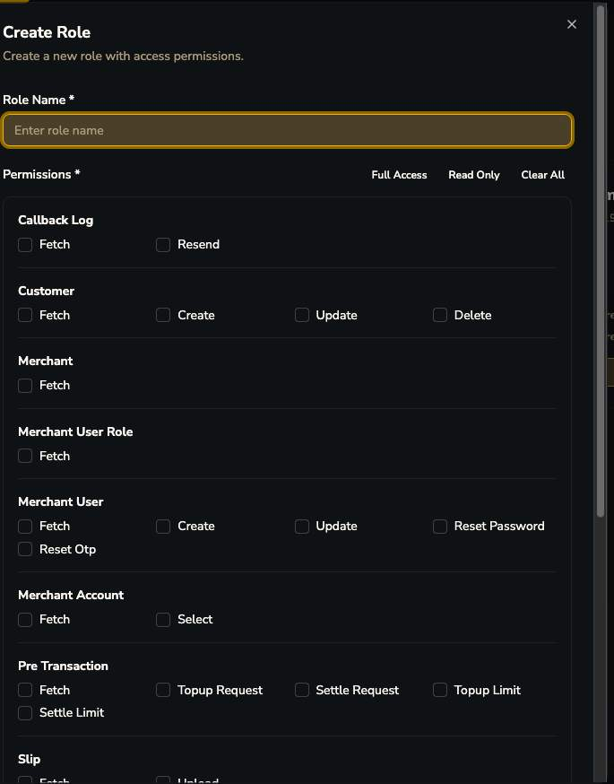
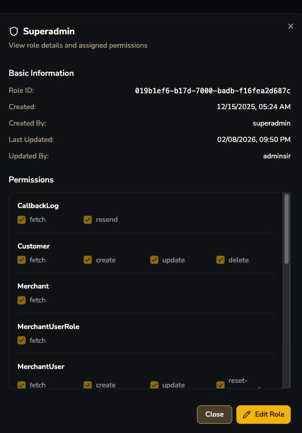

# Merchant Roles

, AcerAdmin(14), Admin(17), Superadmin(24)")

## ความแตกต่างสำคัญจาก Company Roles

| Module | Actions ที่ Merchant Role เห็น | ต่างจาก Company Role ยังไง |
|---|---|---|
| `PreTransaction` | fetch, **topup-request**, **settle-request**, **topup-limit**, **settle-limit** | ไม่มี cancel/manual-success/match/refund — Merchant ทำได้แค่ "ขอ" ไม่ใช่ "อนุมัติ/execute" |
| `Merchant` | fetch เท่านั้น | ฝั่ง Company มี create/update/reset-api-key/hold/unhold — merchant แก้ config ตัวเองไม่ได้เลย |
| `Slip` | fetch, **upload** | merchant user อัปโหลดสลิปแทน End User ได้ |
| `WalletMerchant` | fetch เท่านั้น | ดู wallet ตัวเองได้ แก้ไม่ได้ |
| `CallbackLog` | fetch, resend | merchant resend webhook เองได้ (ถ้ามี permission) |

!!! tip "สรุป flow Topup/Settlement ที่แท้จริง"
    เป็น 2-step flow: **Merchant ขอ (topup-request/settle-request) → Admin อนุมัติ/execute จริง** (ผ่าน permission `settle-request`/`collect-fee-request` ฝั่ง Company) — ไม่ใช่แค่ manual banking ธรรมดาอย่างที่เอกสาร OpenAPI เดิมพูดถึง
