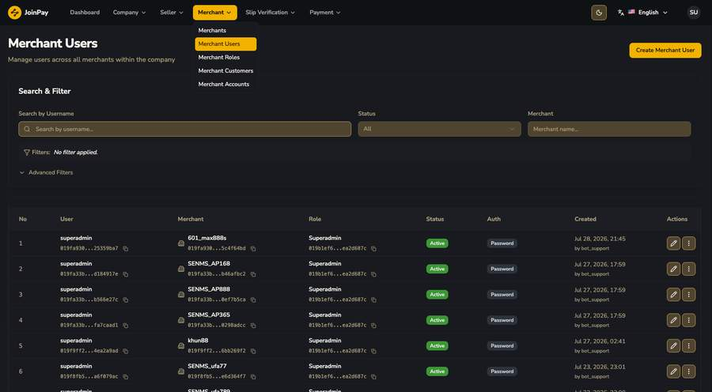
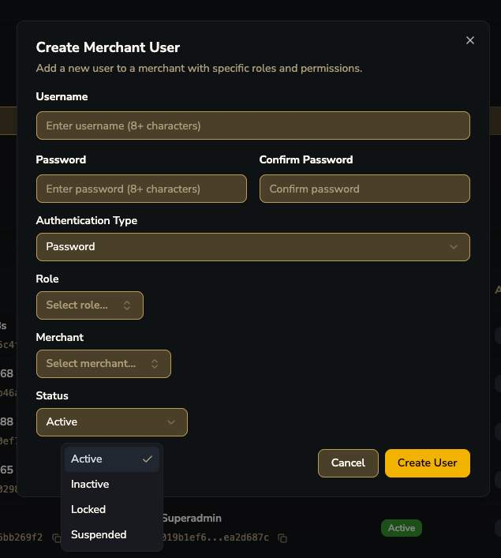
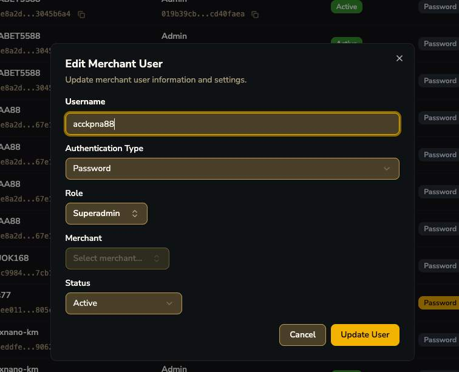

# Merchant Users

!!! tip "ข้อสังเกต"
    Merchant User หลายรายถูกสร้างโดย `bot_support` (ระบบอัตโนมัติ) ไม่ใช่ admin พิมพ์เอง — สะท้อนว่ามีกระบวนการ automated merchant onboarding อยู่เบื้องหลัง

| ฟิลด์ | รายละเอียด |
|---|---|
| Username / Password (8+ ตัวอักษร) | สำหรับ login เข้า merchant portal |
| Authentication Type | เห็นแค่ "Password" — hint ว่าอนาคตรองรับ auth แบบอื่นได้ |
| Role | ผูกกับ Merchant Role ที่สร้างไว้ |
| Merchant | ผูก user นี้กับ merchant ไหน |
| Status | Active / Inactive / Locked / Suspended |

!!! question "ข้อสังเกต"
    ตอน Edit field "Merchant" มักจะ disabled (สีเทา) — คาดว่า merchant assignment แก้ไม่ได้หลังสร้าง ต้องลบแล้วสร้างใหม่แทน (ยังไม่ยืนยัน)
