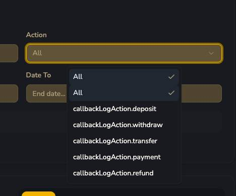
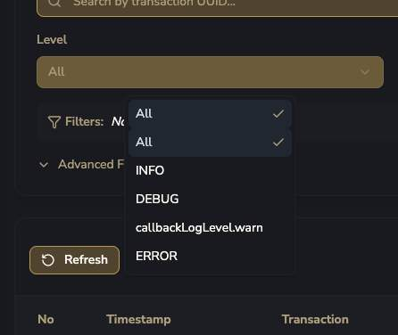
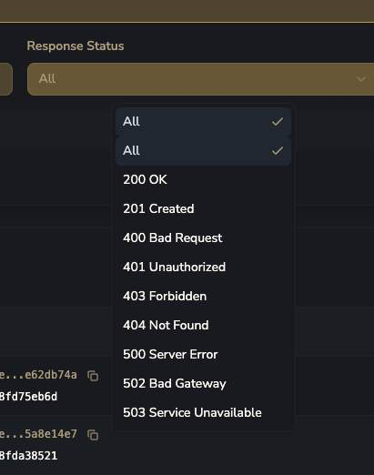
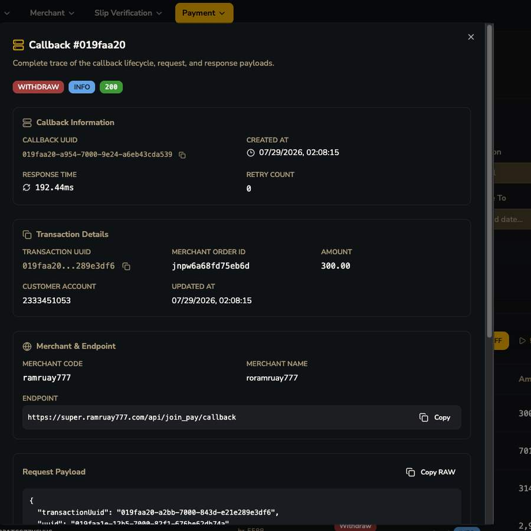
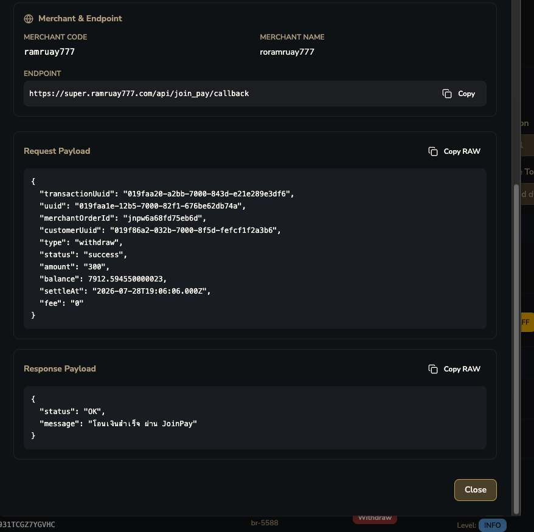
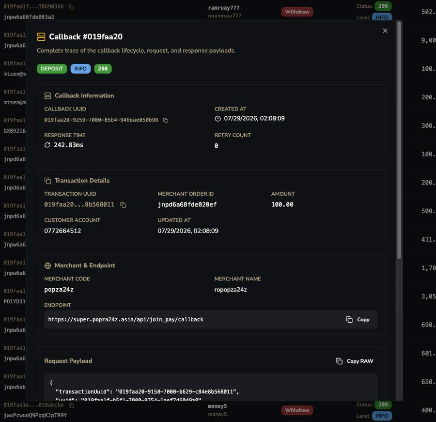
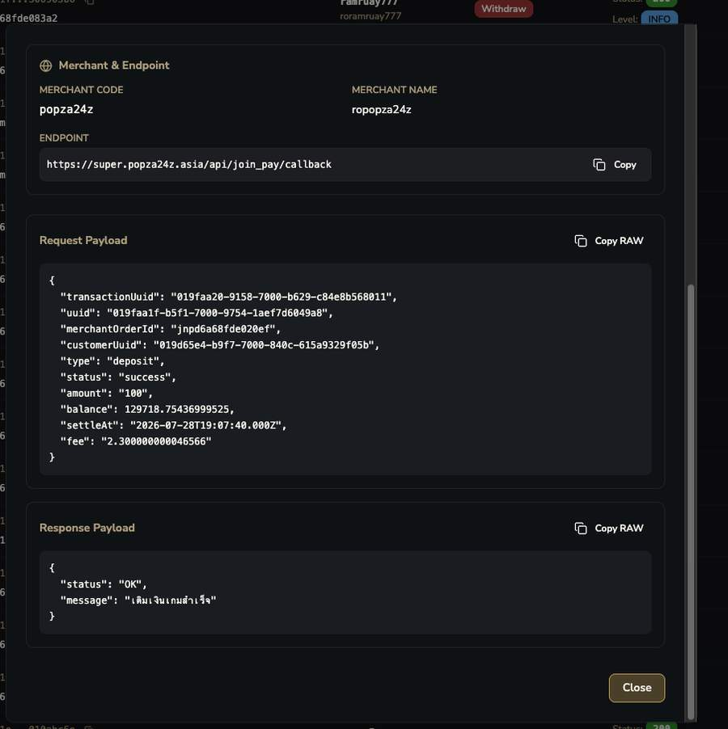
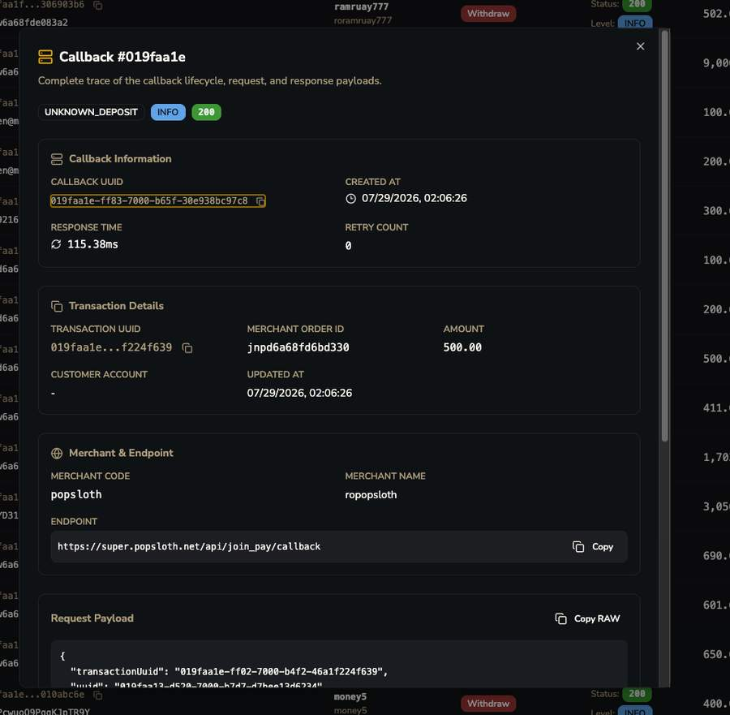
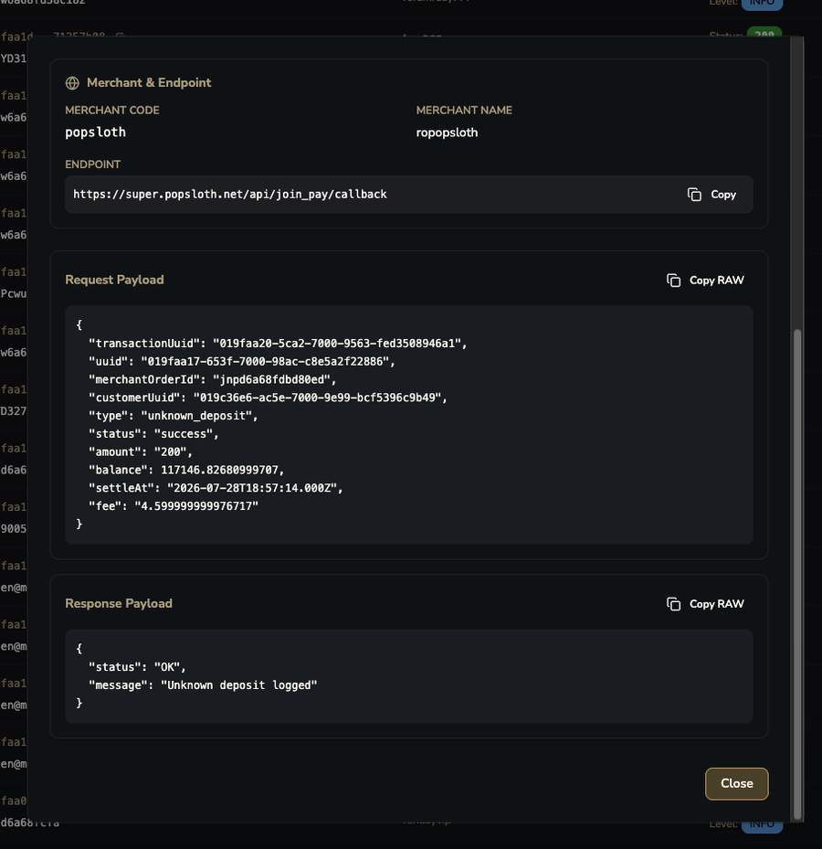

# Callback Logs

ประวัติการยิง Webhook ไปหา Merchant

, Amount, Time/Retries")

## ฟิลเตอร์ทั้งหมด

=== "Action"
    
=== "Level"
    
=== "Response Status"
    

!!! danger "Callback Log Action ≠ Transaction Type"
    Action ของ callback log มี: deposit, withdraw, **transfer**, **payment**, refund — มี "transfer" กับ "payment" ที่ไม่เคยเจอในทั้ง Transaction Type และเอกสารอื่นๆ เลย

!!! question "คำถามค้าง"
    Callback Log Action "transfer" และ "payment" คืออะไร ใช้ต่างจาก Transaction Type ยังไง?

| คอลัมน์ในตาราง | ความหมาย |
|---|---|
| Timestamp | เวลาที่ยิง callback |
| Transaction (TX / Order) | UUID ของ transaction + Merchant Order ID |
| Merchant | ปลายทางที่ยิงไปหา |
| Action | ประเภท action ของ callback |
| Status (HTTP code) + Level | HTTP response code จริงที่ merchant ตอบกลับ + severity level ของ log |
| Amount | จำนวนเงินใน callback นั้น |
| Time / Retries | response time (ms) + จำนวนครั้งที่ retry แล้ว |

## Callback Detail Modal — เห็น Payload จริง

=== "Withdraw (1)"
    
=== "Withdraw (2)"
    

!!! tip "ยืนยัน HMAC signature fields ตรงกับที่เอกสาร OpenAPI เขียนไว้"
    Request Payload จริง:

    ```json
    { "transactionUuid": "...", "uuid": "...", "merchantOrderId": "...",
      "customerUuid": "...", "type": "withdraw", "status": "success",
      "amount": "300", "balance": 7912.594550000023,
      "settleAt": "2026-07-28T19:06:06.000Z", "fee": "0" }
    ```

    field ที่ต้องเซ็น HMAC (transactionUuid|merchantOrderId|customerUuid|type|status|amount) ตรงกับที่เอกสารเขียนไว้ทุกประการ `uuid` และ `fee` อยู่ใน payload แต่ไม่ถูกเซ็น — ถูกต้องตามที่เอกสารเดิมระบุ

    **field ใหม่ที่ payload มีแต่เอกสารไม่เคยพูดถึง:**

    - `balance` — ยอด wallet ของ merchant **หลัง** transaction นี้
    - `settleAt` — timestamp ที่ settle จริง

=== "Deposit (1)"
    
=== "Deposit (2)"
    

=== "Unknown Deposit (1)"
    
=== "Unknown Deposit (2)"
    

!!! danger "แก้ความเข้าใจผิดจากเอกสารเดิม — unknown_deposit ก็มี webhook ยิงออกไปด้วย!"
    เอกสาร OpenAPI เดิมเข้าใจว่า unknown_deposit ต้องรอ manual reconcile อย่างเดียว ไม่มีการแจ้ง merchant — **แต่จริงๆ merchant ได้รับ webhook แจ้งว่าเงินเข้ามาแบบ unknown_deposit ทันที** (response `"message": "Unknown deposit logged"`) เพียงแต่ status "success" ในที่นี้หมายถึงการ log สำเร็จ ไม่ใช่การ credit เงินให้ End User

!!! tip "Retry Policy ที่ยืนยันแล้ว"
    Retry ทำได้เรื่อยๆ **ไม่มี limit ตายตัว จนกว่าจะยิงสำเร็จ (match/callback ได้)** ไม่ใช่ fixed retry count/interval แบบระบบทั่วไป
