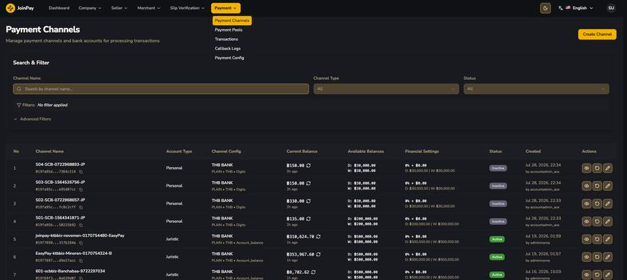
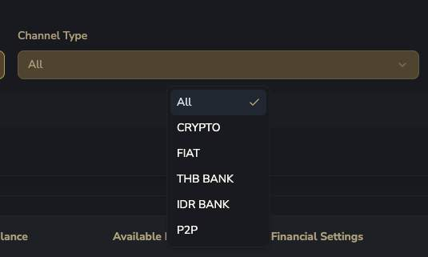
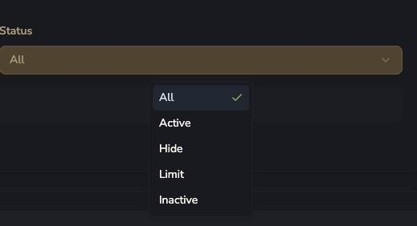
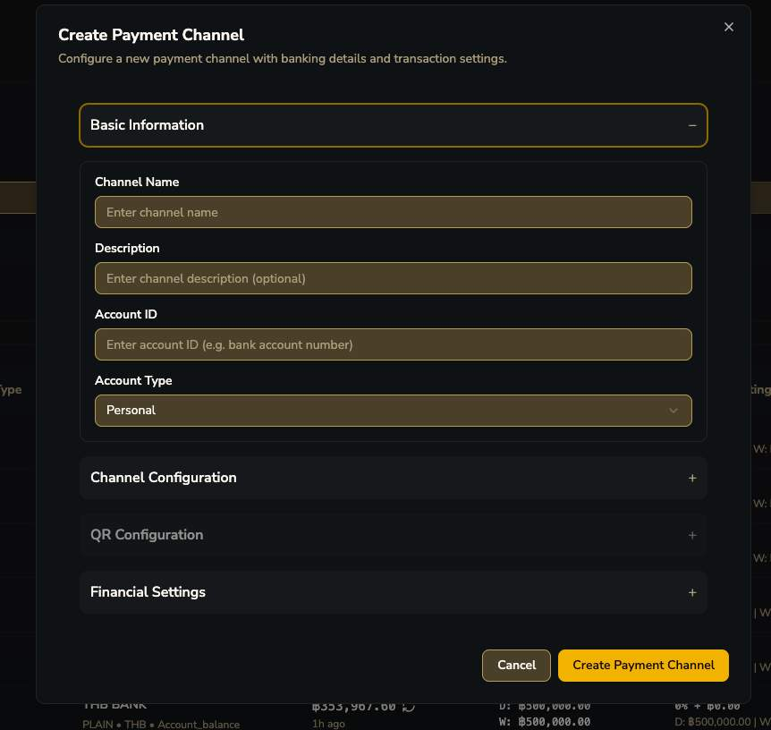
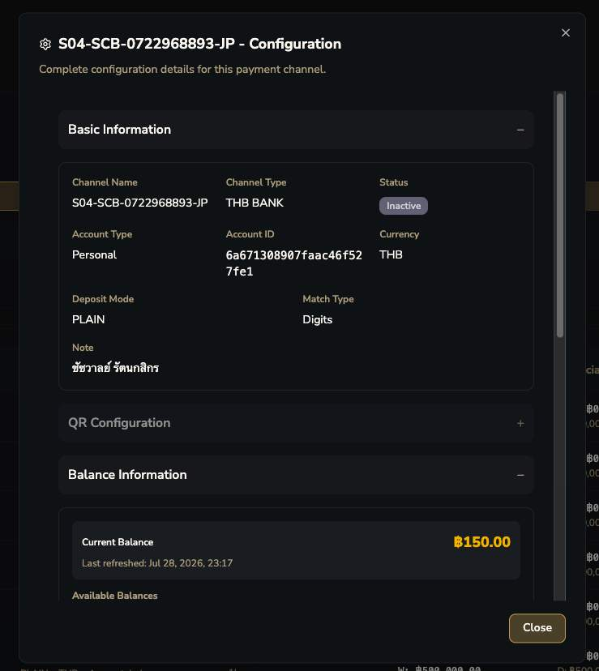

# Payment Channels

!!! danger "ปรับความเข้าใจใหม่ — ไม่ได้มีบัญชี 'PGWM' บัญชีเดียว"
    เอกสาร OpenAPI เดิมเขียนราวกับมีบัญชีรับเงินบัญชีเดียว (PGWM) แต่จริงๆ ระบบมี **Payment Channel หลายสิบบัญชีพร้อมกัน** แต่ละอันคือบัญชีธนาคารจริง 1 บัญชี — QR code ที่ End User เห็นแต่ละครั้งอาจเป็นบัญชีคนละใบ ขึ้นกับ routing strategy ของ [Pool](pools.md) ที่ merchant นั้นถูก assign ไว้

| คอลัมน์ | ความหมาย |
|---|---|
| Channel Name | ชื่ออ้างอิง |
| Account Type | **Personal** vs **Juristic** — ผสมกันในระบบ |
| Channel Config | สรุปย่อ: ธนาคาร • Deposit Mode • Match Type |
| Current Balance | ยอดคงเหลือปัจจุบัน |
| Available Balances (D / W) | วงเงินคงเหลือที่ใช้ได้วันนี้ แยก Deposit / Withdraw |
| Financial Settings | สูตร fee ของ channel นี้ (% + ฿ fixed) |
| Status | Active / Hide / Limit / Inactive |

## Channel Type dropdown

!!! tip "ระบบรองรับมากกว่า 3 ประเภทที่เอกสารเดิมเขียนไว้"
    เอกสาร OpenAPI เดิมพูดถึงแค่ thb_bank / p2p / crypto — Console จริงมี **CRYPTO, FIAT, THB BANK, IDR BANK, P2P** — พบ **IDR BANK** บ่งชี้ว่าระบบรองรับสกุลเงินอินโดนีเซียด้วย

## Status dropdown

4 สถานะ — `Hide` น่าจะหมายถึงซ่อนจาก routing ชั่วคราวแต่ไม่ปิดการทำงาน, `Limit` น่าจะหมายถึงถูกจำกัดการใช้งานชั่วคราว

## ฟอร์ม Create/Edit Payment Channel

| ฟิลด์ | รายละเอียด |
|---|---|
| Channel Name / Description | ชื่อ + คำอธิบาย (optional) |
| Account ID | เลขบัญชีธนาคารจริง |
| Account Type | Personal / Juristic |

## รายละเอียดเต็มจากหน้า Configuration (View)

| ฟิลด์ | รายละเอียด |
|---|---|
| Channel Type | เช่น THB BANK |
| Currency | THB (หรือ IDR สำหรับ IDR BANK) |
| Deposit Mode | **PLAIN** ที่เห็นในตัวอย่าง — คาดว่ามีโหมดอื่นด้วย (เช่น QR) |
| Match Type | **Digits** — ดู [Deep-dive: Match Type](../match-type.md) สำหรับการวิเคราะห์เต็มรูปแบบ |

 + Transaction Limits + Fee Configuration ระดับ Channel")

!!! tip "Daily Rolling Limit ต่อบัญชี (ชั้นที่ 3 ของ Transaction Limit)"
    แต่ละ channel มี Deposit Limit / Withdraw Limit ของตัวเอง พร้อม **"Resets at" เที่ยงคืนทุกวัน** ลำดับชั้นทั้งหมด: **Company default → Merchant override → Pool limit → Channel limit (reset รายวัน)**

!!! tip "ไขปริศนา 'Payment Fee'"
    แต่ละ Payment Channel มี **Fee Percentage + Fixed Fee Amount ของตัวเอง** พร้อม "Total Fee Formula" — ตรงกับคำว่า "Payment Fee" ที่เห็นใน Seller Fee Dashboard ทุกประการ
