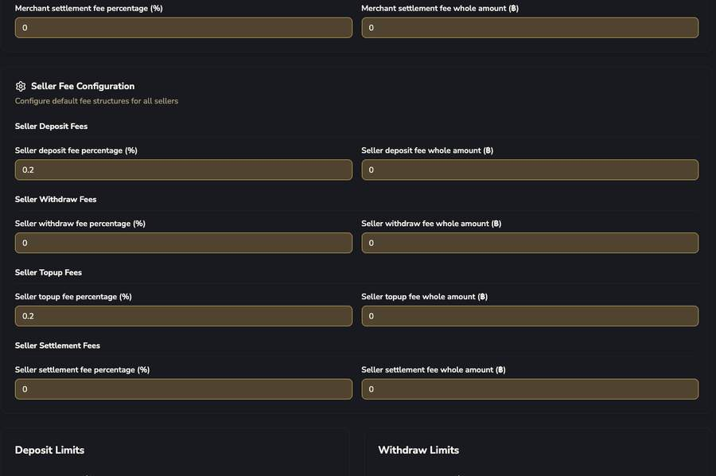

# Payment Config (Company Configuration)

ค่า Default ระดับบริษัท — "ต้นน้ำ" ของทุกค่า default merchant ใหม่ที่สร้างขึ้นจะ inherit ค่าจากที่นี่ (แล้วไป override เฉพาะรายได้ทีหลังผ่านหน้า Create/Edit Merchant)

")

| ฟิลด์ | รายละเอียด |
|---|---|
| Action Status (global) | Deposit/Withdraw/Topup/Settlement Status, Settlement Collect Fee, Auto Collect Fee Daily |
| Merchant Fee Configuration | ค่า default Platform Fee % + Fixed ต่อ 4 ประเภท — ตัวอย่างจริง: Deposit 1.3%, Topup 1.3%, Withdraw/Settlement 0% |

ค่า default Seller Fee % + Fixed ต่อ 4 ประเภทเหมือนกัน — ตัวอย่างจริง: Deposit/Topup 0.2%, Withdraw/Settlement 0%

 + Slip Verification Configuration")

!!! tip "พบคำตอบของคำถามค้างจากเอกสาร OpenAPI เดิม"
    **"Minimum Pre-Transaction Age (seconds)"** — นี่คือค่าที่ตั้งค่าได้ (configurable) สำหรับกฎ 300 วินาทีที่เอกสารเดิมพูดถึง (412 `slip_verify_too_early`) ไม่ใช่ hardcode ตายตัว

 vs Reveal (legacy)")

!!! danger "P2P Deposit Flow มี 2 โหมด ไม่ใช่แค่ 'hosted checkout URL' เดียว"
    **Link (checkout URL)** — โหมดปัจจุบัน/แนะนำ — customer ได้รับ URL ไปกรอกข้อมูลเอง (ตรงกับที่เอกสาร OpenAPI เดิมอธิบาย)

    **Reveal (legacy)** — API expose เลขบัญชีเต็มให้ merchant โดยตรง (ของเก่า ไม่แนะนำใช้แล้ว)

P2P Settlement Rail มี fee 4 ประเภทเป็นค่า default ระดับ Company เหมือนกัน ก่อนที่ merchant จะ override เองในฟอร์ม P2P Settings
