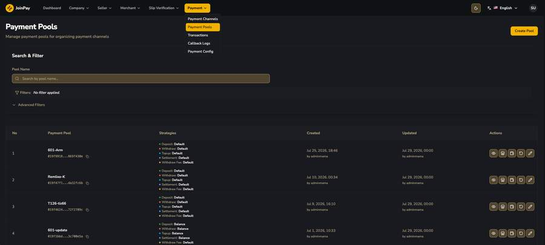
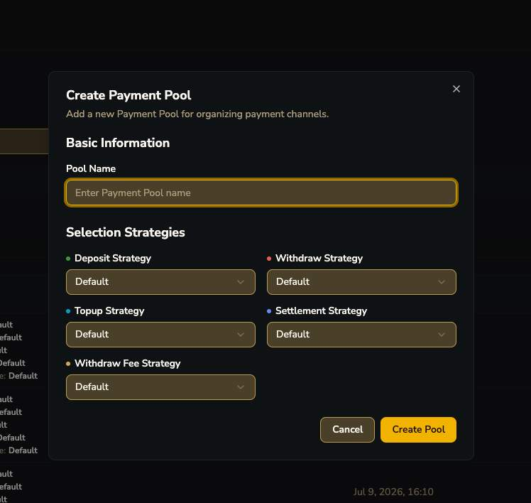
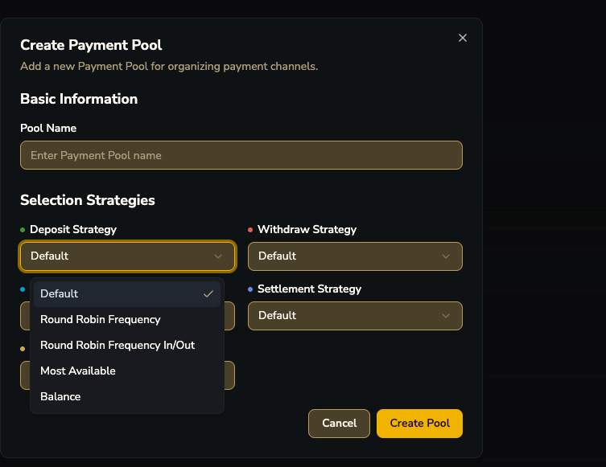
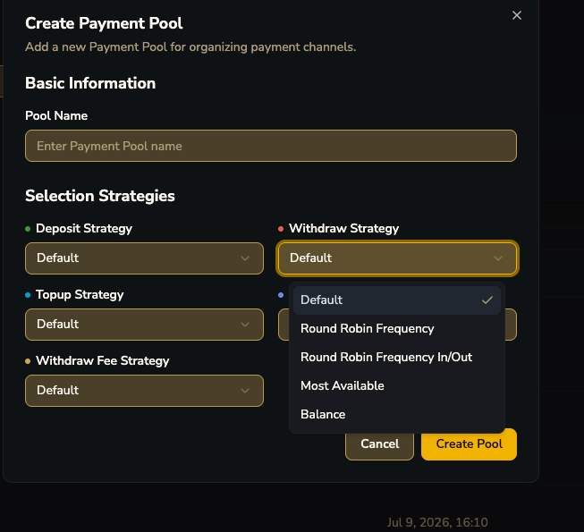
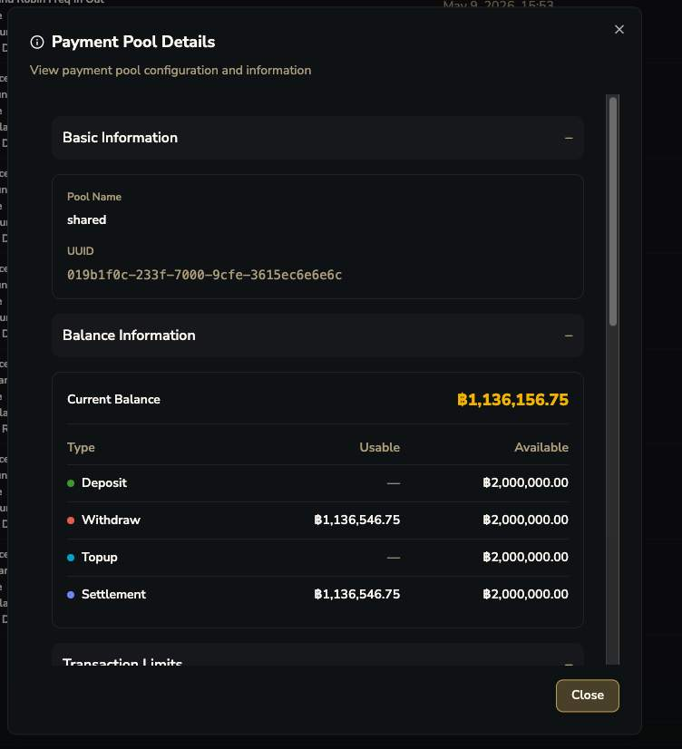
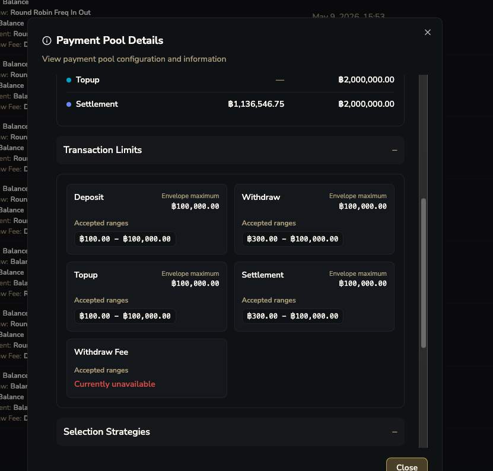
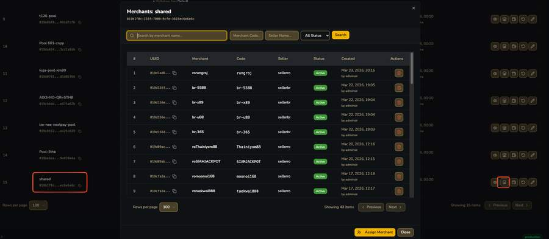
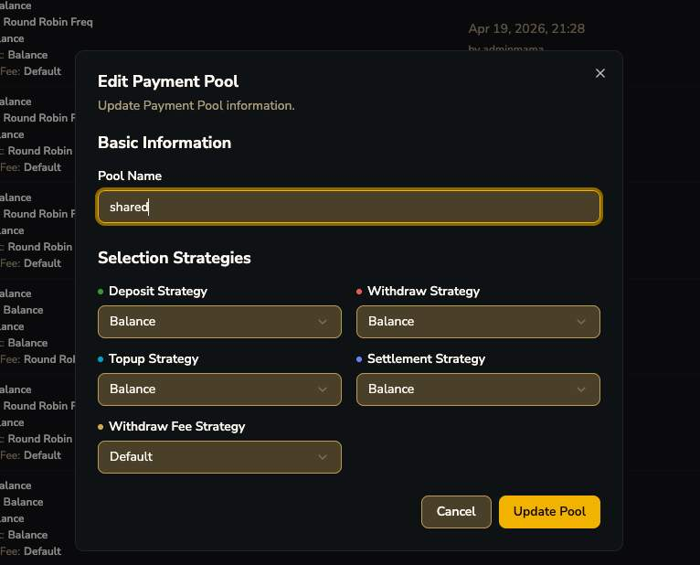

# Payment Pools

!!! tip "Payment Pool คืออะไร"
    Pool คือกลุ่มของ [Payment Channel](channels.md) (บัญชีธนาคารจริงหลายบัญชี) ที่ใช้ **Selection Strategy** ร่วมกัน — **Merchant ไม่ได้มีบัญชีของตัวเองตรงๆ แต่ถูก assign เข้า Pool** ที่มีหลายบัญชีให้ใช้ร่วมกัน แล้วระบบเลือกว่าจะ route เงินเข้า/ออกบัญชีไหนตามกลยุทธ์ที่ตั้งไว้

## ฟอร์ม Create Payment Pool + Selection Strategy

=== "Deposit Strategy"
    
=== "Withdraw Strategy"
    

| Strategy | ความหมาย (คาดการณ์จากชื่อ) |
|---|---|
| `Default` | ใช้ลำดับ/กติกาพื้นฐานของระบบ |
| `Round Robin Frequency` | วนใช้บัญชีตามจำนวนครั้งที่เคยถูกใช้ |
| `Round Robin Frequency In/Out` | วนแยกฝั่ง deposit-in กับ withdraw-out |
| `Most Available` | เลือกบัญชีที่เหลือ limit/วงเงินเยอะที่สุด |
| `Balance` | เลือกบัญชีตามยอดคงเหลือ |

!!! question "คำถามค้าง"
    รายละเอียด logic ที่แท้จริงของแต่ละ strategy ยังไม่มีการยืนยัน เป็นการตีความจากชื่อเท่านั้น

## Payment Pool Details

| ฟิลด์ | รายละเอียด |
|---|---|
| Envelope Maximum | เพดานรวมสูงสุดที่ pool นี้ยอมรับต่อประเภท action |
| Accepted ranges | ช่วง min-max ของยอดเงินต่อ transaction ที่ pool ยอมรับ |
| Withdraw Fee (Currently unavailable) | พบสถานะนี้ในตัวอย่าง — อาจหมายถึงยังไม่ถูก config |

## Merchant ที่ผูกอยู่ใน Pool

!!! tip "ยืนยันความสัมพันธ์ Pool ↔ Merchant"
    Pool ชื่อ "shared" ผูกกับ **43 merchants** พร้อมกัน — ยืนยันชัดว่า **1 Pool : หลาย Merchant** ได้ มีปุ่ม "Assign Merchant" ให้เพิ่ม merchant เข้า pool ได้จากหน้านี้โดยตรง

## Payment Channel ที่อยู่ใน Pool (พร้อม Capabilities)

")

| ฟิลด์ | รายละเอียด |
|---|---|
| Fees (0% + 0) | fee ของ channel นั้นในบริบท pool นี้ |
| Balance / D / W | ยอดคงเหลือ + วงเงิน deposit/withdraw ที่เหลือวันนี้ |
| Match | Match Type ของ channel นั้น (เช่น account_balance) |
| Capabilities: DEP / WDR / SET / FEE | checkbox เปิด-ปิดว่า channel นี้ใช้ทำอะไรได้บ้างในพูลนี้ |

!!! tip "Match Type ที่ 2 — 'account_balance'"
    พบว่า Match Type ของ channel ในพูลนี้เป็น `account_balance` ไม่ใช่ `Digits` — ยืนยันว่ามีวิธี match มากกว่า 1 แบบใช้งานจริงพร้อมกัน (ดู [Deep-dive: Match Type](../match-type.md))

## ฟอร์ม Edit Payment Pool

