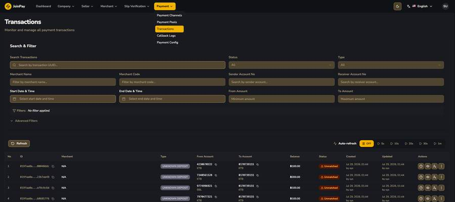
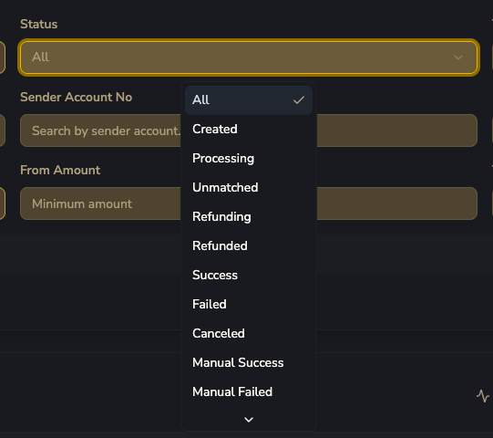
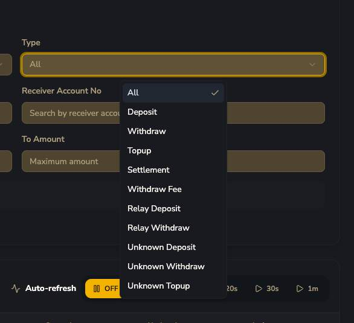
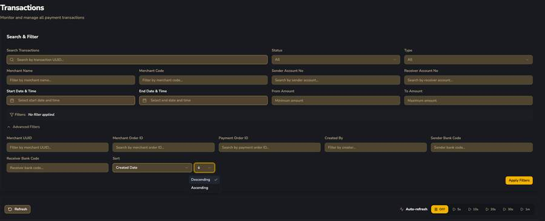
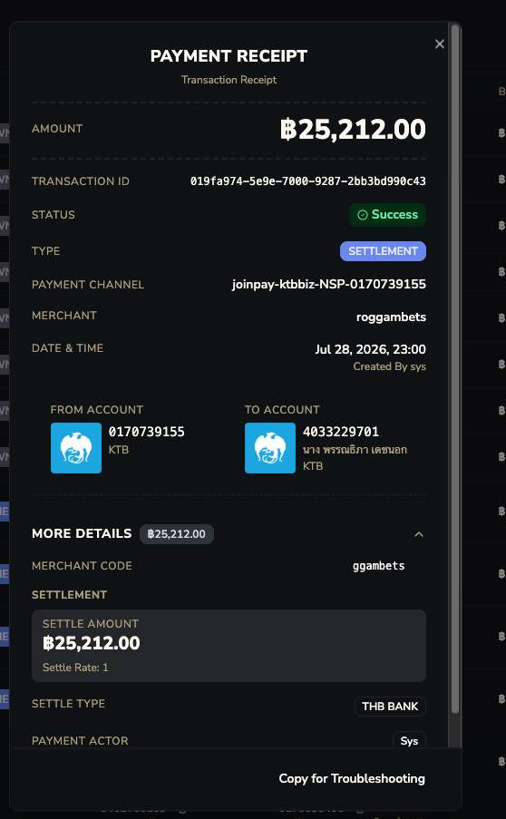
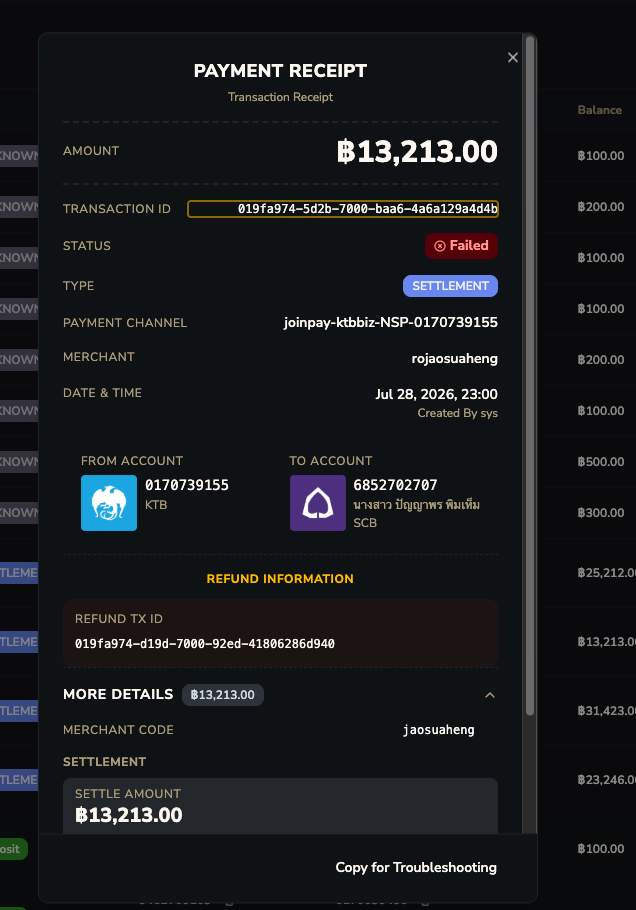
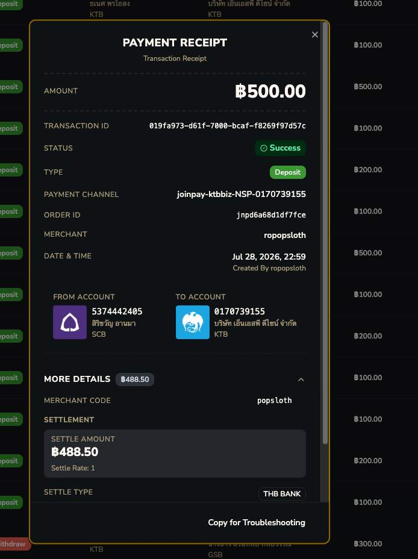
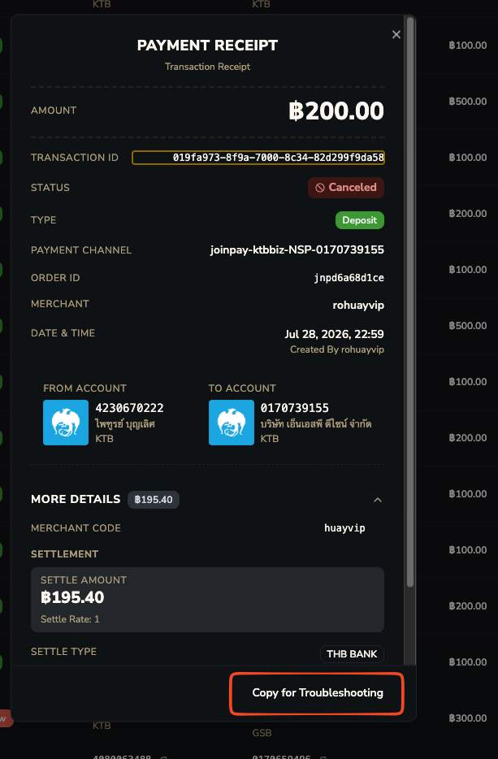
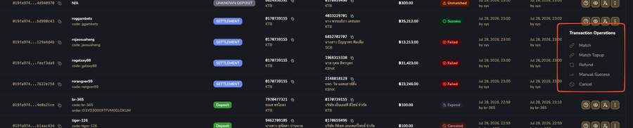

# Transactions

"ห้องเครื่อง" จริงของทั้งระบบ

## ฟิลเตอร์ทั้งหมด

| ฟิลเตอร์ | รายละเอียด |
|---|---|
| Search by transaction UUID | ค้นด้วย transaction ID |
| Status / Type | ดูตารางด้านล่าง |
| Merchant Name / Merchant Code | กรองตาม merchant |
| Sender/Receiver Account No | ค้นด้วยเลขบัญชีต้นทาง/ปลายทาง |
| Start/End Date & Time, From/To Amount | กรองช่วงเวลาและช่วงยอดเงิน |
| Advanced Filters | Merchant UUID, Merchant Order ID, Payment Order ID, Created By, Sender/Receiver Bank Code, Sort |
| Auto-refresh (5s/10s/20s/30s/1m) | รีเฟรชอัตโนมัติสำหรับติดตาม transaction แบบ real-time |

=== "Status dropdown"
    
=== "Type dropdown"
    

!!! danger "Status/Type จริงมีมากกว่าที่เอกสาร OpenAPI เดิมเขียนไว้เยอะมาก"
    **เอกสารเดิมเขียน Status:** created, processing, success, failed, canceled, unhold

    **ของจริงมี:** Created, Processing, **Unmatched**, **Refunding**, Refunded, Success, Failed, Canceled, **Manual Success**, **Manual Failed**, **Expired**

    **เอกสารเดิมเขียน Type:** deposit, withdraw, unknown_deposit, unhold

    **ของจริงมี:** Deposit, Withdraw, **Topup**, **Settlement**, **Withdraw Fee**, **Relay Deposit**, **Relay Withdraw**, Unknown Deposit, Unknown Withdraw, Unknown Topup

!!! question "คำถามค้าง"
    **Relay Deposit / Relay Withdraw** คืออะไร — ไม่เคยเห็นตัวอย่างจริงเลย คาดว่าอาจเป็นการโยกเงินภายในระหว่าง Payment Channel ในพูล

## Payment Receipt — รายละเอียดเมื่อคลิกดู transaction

คลิกไอคอน 👁 หรือ ❓ ที่แถวใดก็ได้ จะเปิด modal "Payment Receipt" แสดงรายละเอียดเต็ม:

=== "Unknown Deposit"
     — ยังไม่มี Merchant ผูก (N/A)")
=== "Settlement สำเร็จ"
    
=== "Settlement ล้มเหลว"
    
=== "Deposit สำเร็จ"
    
=== "Deposit ถูก Cancel"
    

| ฟิลด์ใน Payment Receipt | ความหมาย |
|---|---|
| Amount | จำนวนเงินของ transaction |
| Transaction ID | UUID ของ transaction |
| Status / Type | ดูตารางค่าที่เป็นไปได้ด้านบน |
| Payment Channel | ชื่อ channel ที่ transaction นี้วิ่งผ่าน |
| Merchant | merchant เจ้าของ (N/A ถ้ายัง unmatched) |
| From/To Account | บัญชีต้นทาง-ปลายทาง พร้อมชื่อ+ธนาคาร |
| Settle Type / Amount / Rate | ประเภทการ settle, ยอดหลังหัก fee, อัตราแลกเปลี่ยน |
| Refund TX ID (ถ้ามี) | เมื่อ settlement failed → ระบบสร้าง transaction คู่กันสำหรับ refund |
| Payment Actor | Customer / Sys / Unknown |
| ปุ่ม Copy for Troubleshooting | คัดลอกข้อมูลดิบพร้อม timestamp ครบ 4 ระดับ |

## Transaction Operations — เมนู 3 จุดสำหรับ Unmatched

| Action | รายละเอียด |
|---|---|
| Match | จับคู่ unmatched transaction เข้ากับ **merchant** ด้วยมือ (ดูฟอร์มเต็มด้านล่าง) |
| Match Topup | จับคู่เป็น topup โดยเฉพาะ |
| Refund | คืนเงิน — สร้าง transaction ใหม่ผูก Refund TX ID |
| Manual Success | บังคับให้ transaction สำเร็จด้วยมือ (Type ยังคงเป็น Unknown Deposit ตลอดไป — ต่างจาก Match ที่ Type เปลี่ยนเป็น Deposit ปกติ ดู [ทีม Support](../../support/status-reference.md#match-vs-manual-success)) |
| Cancel | ยกเลิก transaction |

เมนูนี้ตรงกับ permission `PreTransaction: match, match-topup, refund, manual-success, cancel` ที่พบใน [Company Roles](../company/roles.md) เป๊ะ

### ฟอร์ม Match Transaction

เปิดจากปุ่ม "Match" — Title: **"🔗 Match Transaction"** — Subtitle: *"Select a merchant to match with this unmatched transaction."*

| ส่วน | ฟิลด์ |
|---|---|
| แถบข้อมูลบนสุด | Type (badge เช่น UNKNOWN DEPOSIT), Status (Unmatched), Amount, Transaction UUID |
| **Account Information** (กรอบเขียว) | FROM ACCOUNT (ธนาคาร + เลขบัญชี), TO ACCOUNT (ธนาคาร + เลขบัญชี) — แสดงอย่างเดียว แก้ไม่ได้ |
| **Select Merchant to Match** (กรอบม่วง) | **Merchant** * (required) — dropdown เลือก merchant ที่จะจับคู่ พร้อมคำอธิบาย "Select the merchant to match this unmatched transaction. The transaction will be linked to the selected merchant's account." |
| **Update Sender Account Details (Optional)** (กรอบม่วง) | Sender Bank Code (dropdown), Sender Account Number (text) — ให้แก้ไข/เติมข้อมูลบัญชีผู้โอนที่บันทึกไว้ได้ ถ้าข้อมูลเดิมไม่ครบ/ผิด |

ปุ่ม Cancel / 🔗 Match Transaction

!!! danger "ฟอร์มนี้ไม่มีการเลือก 'pre-transaction' ให้เห็นตรงๆ — เลือกแค่ Merchant"
    ต่างจากที่เคยเข้าใจว่า Match คือ "จับคู่กับ pre-transaction ที่มีอยู่แล้ว" — ฟอร์มจริงให้เลือกแค่ **Merchant** โดยตรงเท่านั้น ไม่มีช่องให้เลือก/ค้นหา pre-transaction record เฉพาะเจาะจงเลย **คาดว่า** ระบบข้างหลังอาจไปค้นหา/จับคู่กับ pre-transaction ที่ merchant นั้นมีอยู่เองอัตโนมัติ (ตรงยอดเงิน/เวลา) หลังจากเลือก merchant แล้ว — แต่ยังไม่ยืนยัน mechanism ที่แท้จริงเบื้องหลังปุ่มนี้
