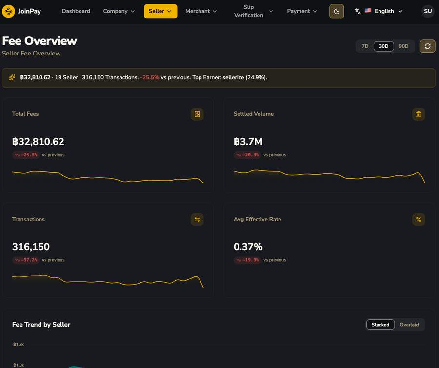
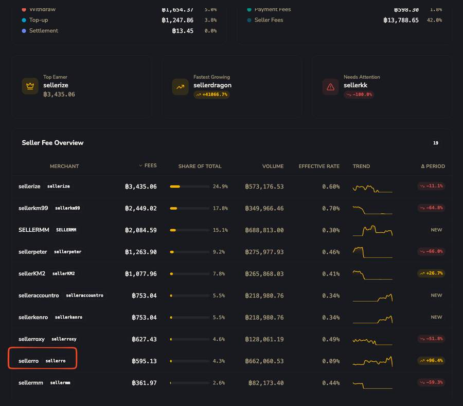
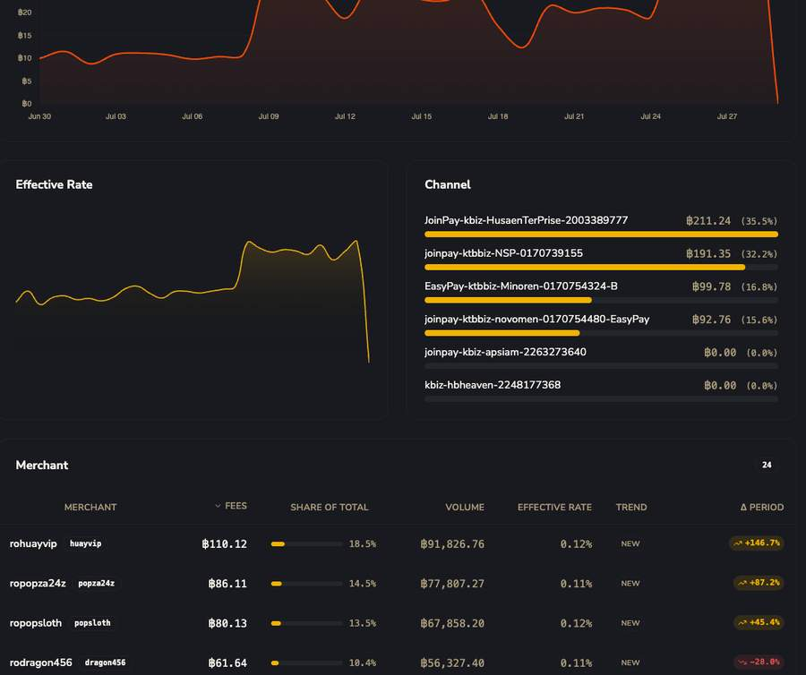

# Fee Dashboard (ระดับ Seller)

ภาพรวมรายได้ค่าธรรมเนียมของ Seller ทั้งหมด

| ฟิลด์ | รายละเอียด |
|---|---|
| ช่วงเวลา 7D / 30D / 90D | เลือกช่วงข้อมูล |
| Total Fees | รวม fee ทุกประเภททุก seller ในช่วงเวลานั้น พร้อม % เทียบช่วงก่อนหน้า |
| Settled Volume | มูลค่า transaction รวมที่ settle แล้ว |
| Transactions | จำนวนธุรกรรมรวม |
| Avg Effective Rate | อัตรา fee เฉลี่ยจริง (fee/volume) |

 + Donut chart: Fees by Type และ Fees by Kind")

### Fees by Type (breakdown ตามประเภท transaction)
Deposit ・ Withdraw ・ Top-up ・ Settlement — จากตัวอย่างจริง Deposit ครองสัดส่วนสูงสุด (91.1%)

!!! danger "Fees by Kind — จุดสำคัญเรื่องชื่อ Fee"
    แบ่งเป็น **Platform Fees**, **Payment Fees**, **Seller Fees** เท่านั้น — **ไม่มี "Partner Fee" ปรากฏที่ไหนในระบบจริงเลย** คำว่า Payment Fee มาจากค่า fee ที่ตั้งไว้ในระดับ [Payment Channel](../payment/channels.md) เอง

| คอลัมน์ตาราง Seller Fee Overview | ความหมาย |
|---|---|
| FEES | ยอด fee ที่ seller นั้นทำได้ในช่วงเวลา |
| SHARE OF TOTAL | % เทียบกับ fee รวมทั้งหมด |
| VOLUME | มูลค่า transaction รวม |
| EFFECTIVE RATE | fee/volume ของ seller นั้นโดยเฉพาะ |
| TREND | กราฟ sparkline ย่อ |
| Δ PERIOD | % เปลี่ยนแปลงเทียบช่วงก่อนหน้า (เขียว/แดง/"NEW") |

## มุมมองระดับ Seller เดี่ยว

 — เห็น '43 Merchant' ใต้สังกัด")

!!! tip "ยืนยันความสัมพันธ์ Seller ↔ Merchant"
    จากตัวอย่างจริง seller ชื่อ "sellerro" มี **43 Merchant** ในสังกัด — ยืนยันชัดว่าเป็นความสัมพันธ์ **1 Seller : หลาย Merchant**

")

แต่ละแถวใน Recent Fees แสดง Date, Type, Merchant, Channel, Volume, และ **Platform Fee / Payment Fee / Seller Fee / Total Fee แยกคอลัมน์ชัดเจน** — เป็นหลักฐานยืนยันหนักแน่นว่าระบบใช้ fee 3 ชนิดนี้จริง
