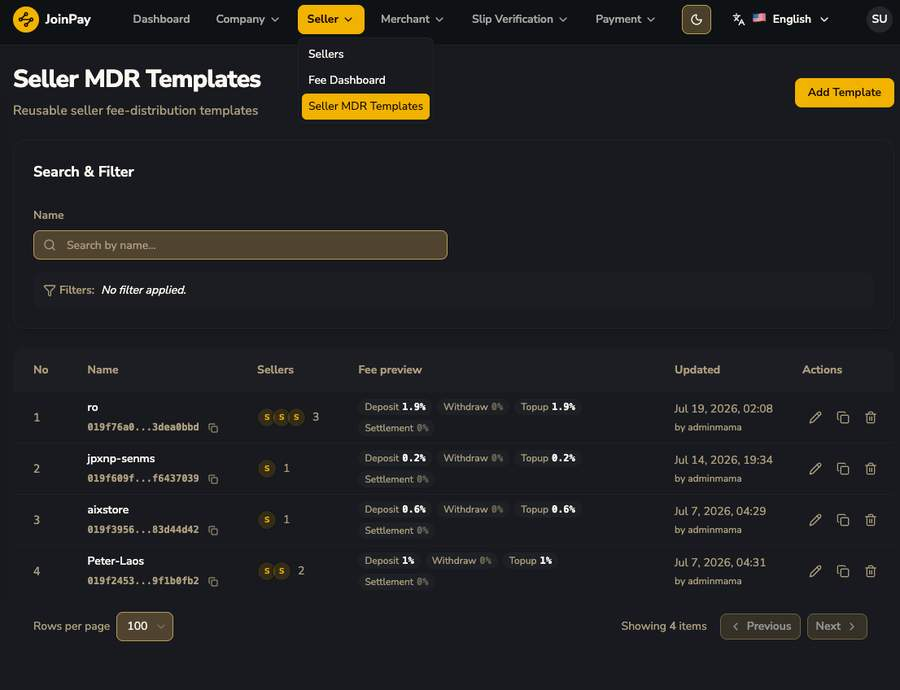
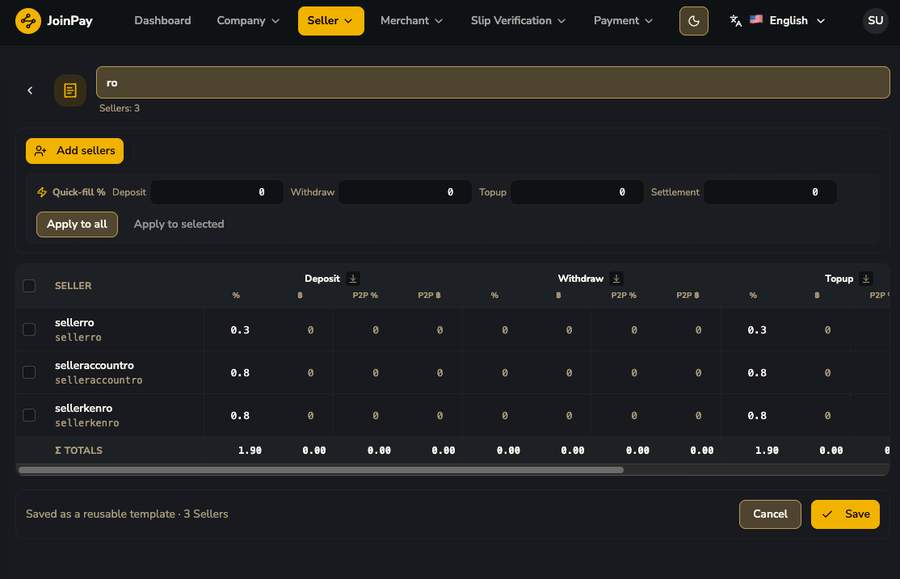

# Seller MDR Templates

MDR (Merchant Discount Rate) Template คือชุดอัตรา fee ที่สร้างไว้ครั้งเดียวแล้วนำไปผูกกับหลาย Seller ได้ (reusable) ไม่ต้องตั้งทีละ seller

| คอลัมน์ | ความหมาย |
|---|---|
| Name | ชื่อ template |
| Sellers | จำนวน/รายชื่อ seller ที่ผูก template นี้อยู่ |
| Fee preview | สรุปย่อ % ของ Deposit/Withdraw/Topup/Settlement |

## หน้าแก้ไข Template — ตาราง Matrix เต็มรูปแบบ

!!! tip "โครงสร้าง Fee Matrix ที่แท้จริง (ละเอียดกว่าที่คาดไว้มาก)"
    แต่ละ transaction type (**Deposit / Withdraw / Topup / Settlement**) แยกเป็น 2 คอลัมน์ย่อยเสมอ:

    - `%` และ `฿` (fixed) สำหรับช่องทางปกติ
    - `P2P %` และ `P2P ฿` สำหรับช่องทาง P2P โดยเฉพาะ — แยก fee structure จาก thb_bank โดยสิ้นเชิง

    มีปุ่ม **Quick-fill %** พร้อม "Apply to all" / "Apply to selected" ให้ตั้งค่าทีเดียวกับหลาย seller ในหน้าเดียว และมีแถว **Σ TOTALS** รวมท้ายตาราง
