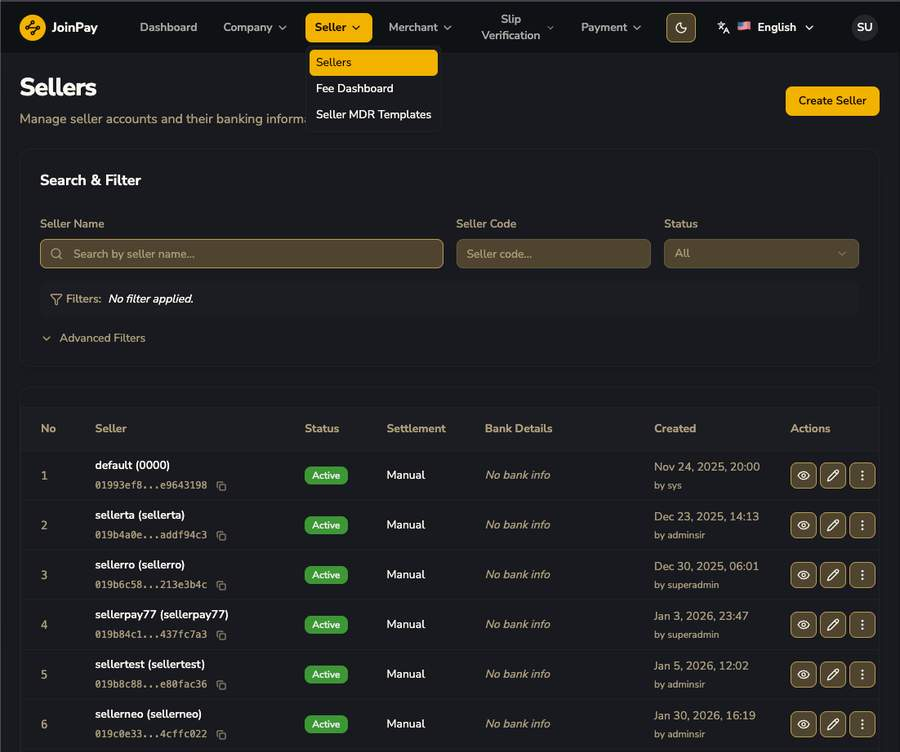

# Sellers

| คอลัมน์ | ความหมาย |
|---|---|
| Seller | ชื่อ + code ของ seller |
| Status | Active/Inactive |
| Settlement | วิธี settle เงินให้ seller — ที่เห็นทั้งหมดเป็น "Manual" |
| Bank Details | ข้อมูลบัญชีธนาคาร — หลายรายเป็น "No bank info" เพราะเป็น optional |
| Created ... by | Audit trail |

## ฟอร์ม Create Seller

, User Credentials")

| ฟิลด์ | รายละเอียด |
|---|---|
| Seller Code | 4-16 ตัวอักษร |
| Seller Name | 6-100 ตัวอักษร |
| Status | Active (default) |
| Settlement Method | Manual (มี option อื่นด้วย — อาจเป็น Auto) |
| Bank Code / Account Number / Account Name | Optional ตอนสร้าง — เติมทีหลังได้ |
| Username / Password | 8-100 ตัวอักษร — **Seller มีระบบ login แยกเป็นของตัวเอง** |

!!! tip "ข้อสังเกต"
    Seller เป็น entity ที่มี portal/login แยกต่างหาก คล้ายกับ Merchant User — เดาได้ว่ามี Seller Portal ที่ seller เข้าไปดูข้อมูลของกลุ่ม merchant ในสังกัดตัวเองได้ (ยังไม่มีภาพหน้าจอ Seller Portal ให้ยืนยัน)
