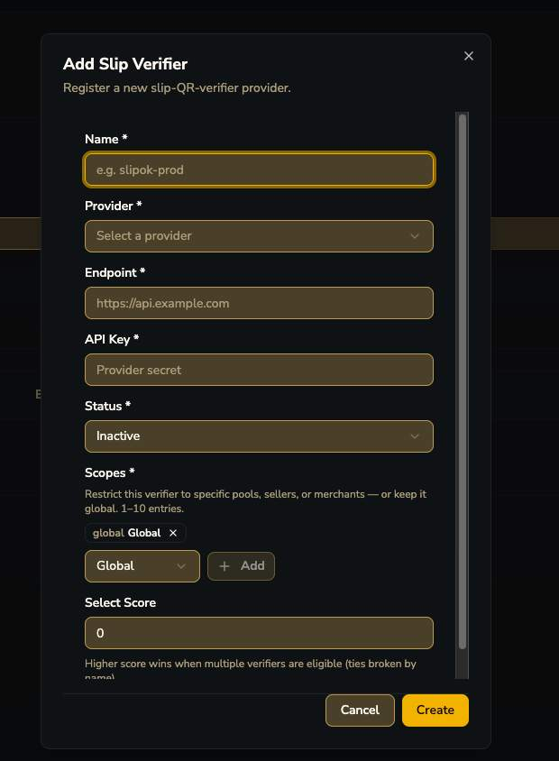

# Slip Verification

ตั้งค่าผู้ให้บริการตรวจสอบสลิป QR ที่ระบบเรียกใช้ตอน Merchant ยิง `POST /verify-slip`

")

!!! tip "สถาปัตยกรรมที่แท้จริงของ verify-slip — ซับซ้อนกว่าที่เอกสาร OpenAPI เขียนไว้มาก"
    verify-slip **ไม่ได้ผูกกับ provider ตายตัวเดียว** — ระบบรองรับ **หลาย slip-QR-verifier provider ภายนอกพร้อมกัน** (3rd-party service ที่ core เรียกไปตรวจสลิป ไม่ได้ decode TLV เองทั้งหมดอย่างที่เอกสารเดิมบอก)

| ฟิลด์ | รายละเอียด |
|---|---|
| Name | ชื่ออ้างอิง เช่น "slipok-prod" |
| Provider | เลือกผู้ให้บริการ (dropdown — ยังไม่เห็นตัวเลือกทั้งหมด) |
| Endpoint | URL ของ provider API |
| API Key | secret key สำหรับเรียก provider นั้น |
| Status | Active / Inactive |
| Scopes | จำกัด verifier ให้ทำงานเฉพาะ pool/seller/merchant บางกลุ่ม หรือ **Global** ก็ได้ (1-10 entries) |
| Select Score | เมื่อมีหลาย verifier ที่ eligible พร้อมกัน ระบบเลือกตัวที่ score สูงกว่า |

!!! question "คำถามค้าง"
    Provider ในระบบมีตัวเลือกอะไรบ้าง (เห็นแค่ placeholder "Select a provider" ยังไม่มีตัวอย่างเลือกจริง)?
