# SOP การผูกบัญชีธนาคารใหม่

คู่มือขั้นตอนภายในที่ทีมปฏิบัติการใช้จริงเวลาจะผูกบัญชีธนาคารใหม่เข้าระบบ (ตั้งแต่เก็บข้อมูลจากลูกค้า/เจ้าของบัญชี ไปจนถึง deploy bot ให้บัญชีนั้นเริ่มทำงาน) — มาจากเอกสาร SOP ภายในที่แปลงมาลงที่นี่ ครอบคลุม 4 ธนาคาร: **GSB, KTBBIZ, KBIZ, SCBBIZ**

!!! danger "ข้อมูลลับถูกปิดบังบางส่วนแล้ว"
    ค่า password/PIN/token ที่เป็น**ตัวหนังสือ**ในหน้านี้ถูกแทนที่ 4 ตัวท้ายด้วย `xxxx` ก่อนนำมาลง — ส่วนที่เป็น**ภาพหน้าจอ**คงไว้ตามต้นฉบับ (มีข้อมูลภายในบางจุดปรากฏอยู่ในภาพ เพราะเป็นข้อมูลที่ทีมภายในรับรู้อยู่แล้ว)

## ภาพรวม 4 ธนาคาร

| ธนาคาร | ต้องมี Bot/อุปกรณ์จริงไหม | หมายเหตุ |
|---|---|---|
| GSB | — | **Outdated — ให้ใช้ manualbot แทน** ไม่ใช้ flow นี้แล้ว |
| KTBBIZ | ไม่ต้อง — REST API ตรง | จบด้วยการกด "Register Device" ครั้งเดียว |
| KBIZ | ต้องมี Bot + อุปกรณ์จริงผ่าน Portainer | ขั้นตอนยาวที่สุดฝั่ง infra |
| SCBBIZ | ไม่ต้อง — ทำผ่านเว็บ SCB Business Anywhere | ต้องตั้ง Maker/Checker + workflow เอง |

!!! tip "ยืนยัน pattern ที่เคยตั้งข้อสังเกตไว้ใน Bank Account"
    SOP นี้ยืนยันตรงๆ สิ่งที่เคยสังเกตไว้ใน [OpsDash → Bank Account](bank-accounts.md): **KTBBIZ จบด้วยฟอร์มเดียว ("Register Device") ไม่มีขั้นตอนสร้าง Bot/deploy container เลย** ต่างจาก **KBIZ ที่ต้องสร้าง Bot object แยก แล้วไป deploy container ผ่าน Portainer เต็มรูปแบบ** — ตรงกับหลักฐานเดิมที่เคยเห็นว่า KTBBIZ ไม่มี Job ID ในระบบ ส่วน KBIZ มี

## GSB (Outdated)

!!! note "ธนาคารนี้เลิกใช้ flow นี้แล้ว"
    เอกสารต้นฉบับมาร์คไว้ตรงๆ ว่า "outdate ไปใช้ manualbot" — เก็บเนื้อหาไว้อ้างอิงประวัติเท่านั้น

**ข้อมูลที่ต้องขอจากเจ้าของบัญชี:** เลขบัญชี, เลขบัตรประชาชน, ซิมมือถือรับ OTP ที่ผูกกับเลขบัตร ปชช., ผูกบัญชีกับ PromptPay, รูปหน้าสำหรับทำ Face Scan (รูปปัจจุบัน หน้าตรง ไม่ใส่ filter เห็นหน้าชัด ถ่ายจากกล้องจริง), รูปบัตรประชาชน, รูปหน้าแรกสมุดบัญชี

**ขั้นตอน:** ส่งข้อมูลให้ Admin → Admin นัดหมายเวลาลงทะเบียนเพื่อรับ OTP

## KTBBIZ

([business.krungthai.com](https://business.krungthai.com/))

**ข้อมูลที่ต้องขอ:** เลขบัญชี, ชื่อบริษัท, เบอร์โทร, CompanyId/Username/Password/PIN สำหรับเข้าแอปพลิเคชันมือถือ, email ที่ผูกกับบัญชีเพื่อรับ OTP

**ขั้นตอนตั้งค่าใน OpsDash:**

1. เลือกเพิ่มบัญชี Kind = **KTBBIZ** ในฟอร์ม "Add New Bank Account"

    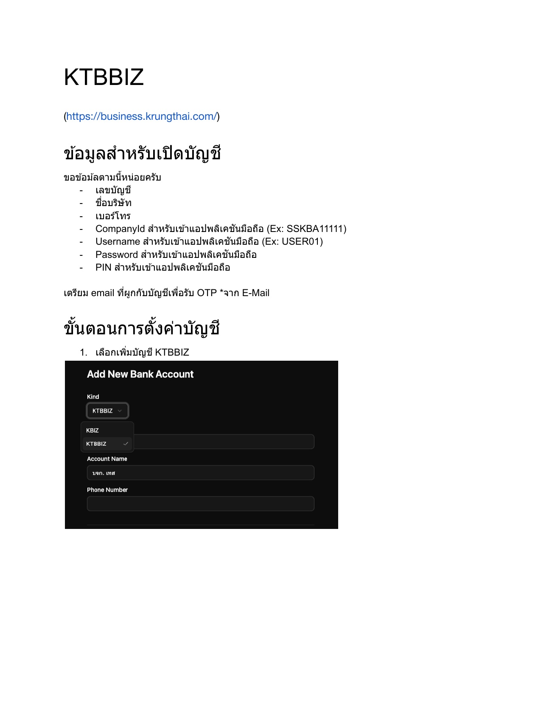

2. กรอก **KTBBIZ Specific Fields** (Company Name, Username, Password, PIN) ครบแล้วกด **Register Device**
3. ได้ **Device ID** กลับมาแล้วกด **Save**

    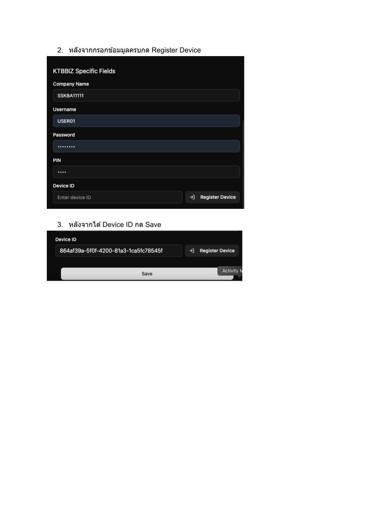

จบแค่นี้ — ไม่มีขั้นตอนสร้าง Bot หรือ deploy container ต่อ

## KBIZ

**ข้อมูลที่ต้องขอ:** เลขบัญชี, ชื่อบริษัท, เบอร์โทร, Username/Password/PIN สำหรับแอป KBIZ, อุปกรณ์ (มือถือ + "กล่องดำ" — อุปกรณ์ควบคุมมือถือจริง)

### ขั้นที่ 1 — สร้างบัญชีใน OpsDash

เพิ่มบัญชี Kind = **KBIZ** กรอก KBIZ Specific Fields (Username, Password) ให้ครบ แล้วกด **Save**

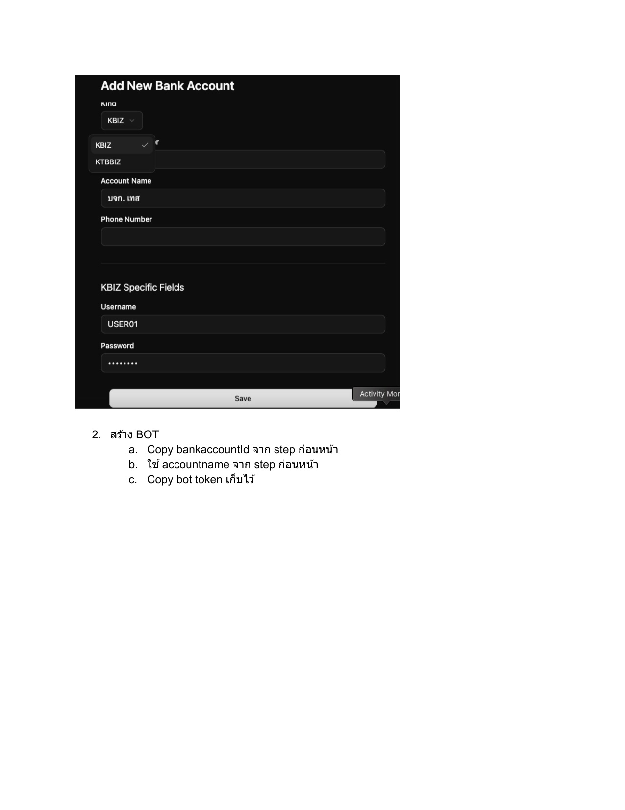

### ขั้นที่ 2 — สร้าง BOT

1. Copy `bankAccountId` จาก step ก่อนหน้า
2. ใช้ `accountname` จาก step ก่อนหน้า
3. Copy bot token เก็บไว้ (ต้องใช้ตอนตั้งค่า container)

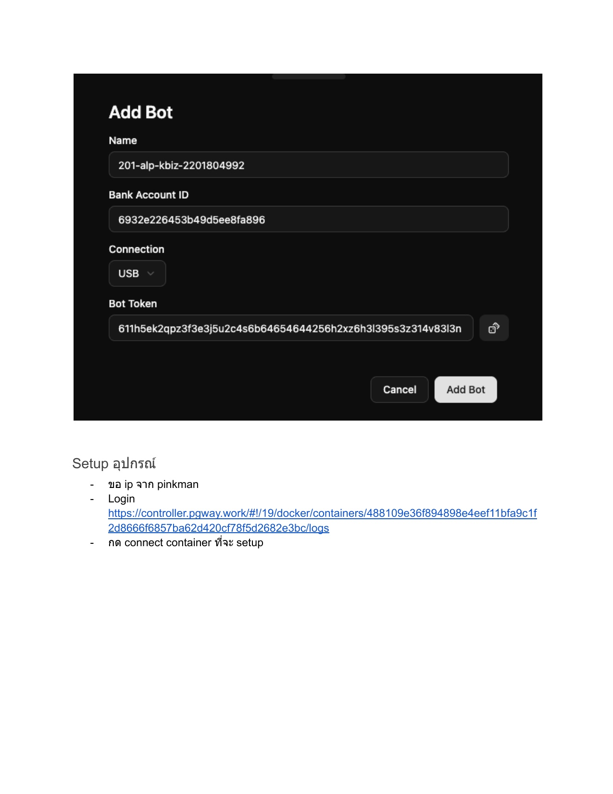

!!! tip "ตัวอย่าง naming convention ที่เห็นในภาพ"
    ชื่อ Bot ในตัวอย่างเป็นรูปแบบ `<station>-<กลุ่ม>-<ยี่ห้อ>-<เลขบัญชี>` เช่น `201-alp-kbiz-2201804992` — ใช้ระบุว่า bot นี้รันอยู่บน station ไหน กลุ่มไหน

### ขั้นที่ 3 — Setup อุปกรณ์ผ่าน Portainer

- ขอ IP จากทีม **"pinkman"** (ทีม/บุคคลที่ดูแลอุปกรณ์จริง)
- Login เข้า `controller.pgway.work` (Portainer instance ที่จัดการ container ของอุปกรณ์บอททั้งหมด)
- กด **connect container** ที่จะ setup

!!! danger "ไขคำถามค้างแล้ว — PGWay อยู่ใต้โดเมนอะไร"
    เคยเป็นคำถามค้างว่าไม่เคยเห็น URL ของ PGWay เลยระหว่างสำรวจ — SOP นี้ยืนยันว่า infra เบื้องหลัง PGWay ใช้ **Portainer CE** ที่โฮสต์อยู่ใต้โดเมน `controller.pgway.work` สำหรับบริหาร container ของอุปกรณ์บอท (ดู [คำถามที่ยังไม่มีคำตอบ](../open-questions.md))

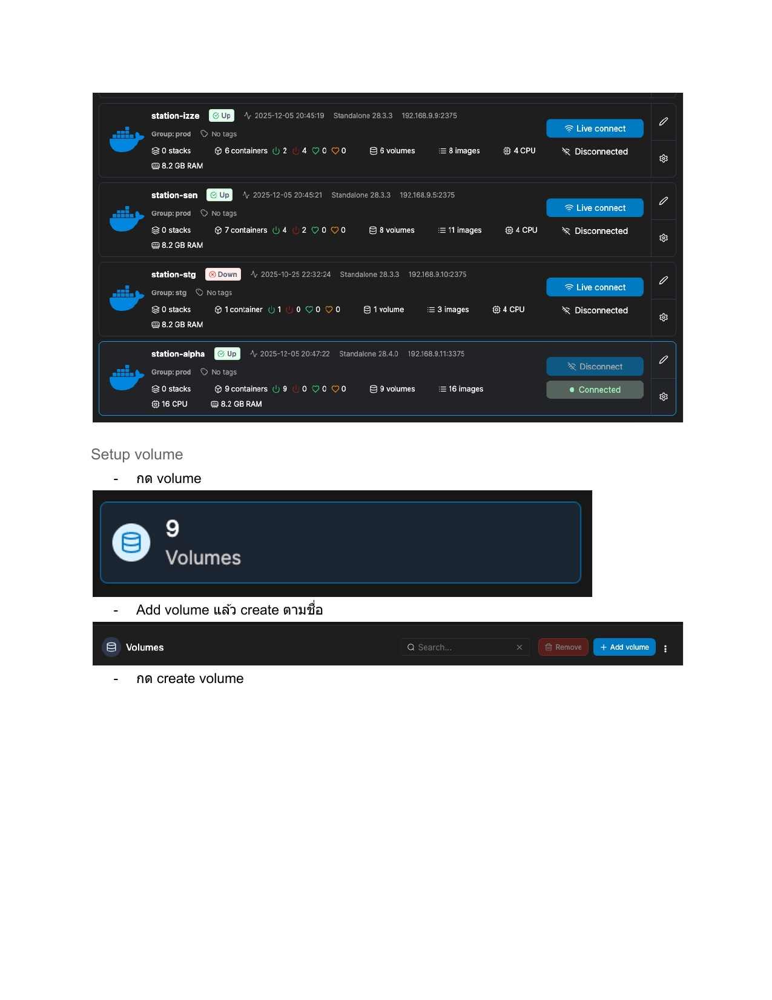

**Setup volume:**

1. กด **Volumes** → **Add volume** → ตั้งชื่อตาม pattern `<station>-<ยี่ห้อ>-<เลขบัญชี>_adb` แล้ว **Create the volume**

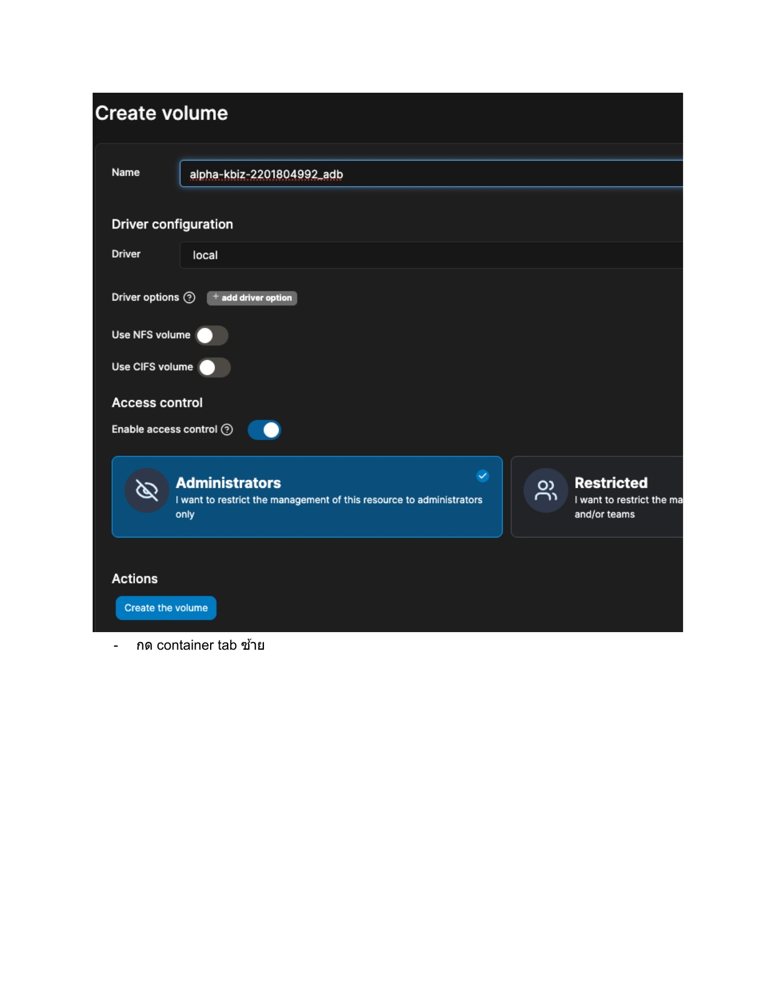

**Setup container:**

1. กด tab **Containers** ทางซ้าย → **Add container**

    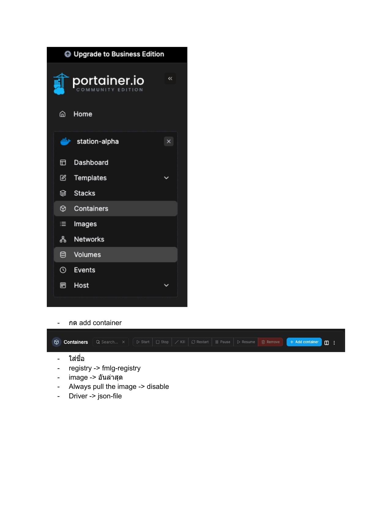

2. ใส่ชื่อ (pattern เดียวกับ volume) → **Registry**: `fmlg-registry` → **Image**: `fmlg/payway/bot:v0.1.17` (อัปเดตล่าสุดเสมอ) → **Always pull the image**: disable → **Driver**: `json-file`

    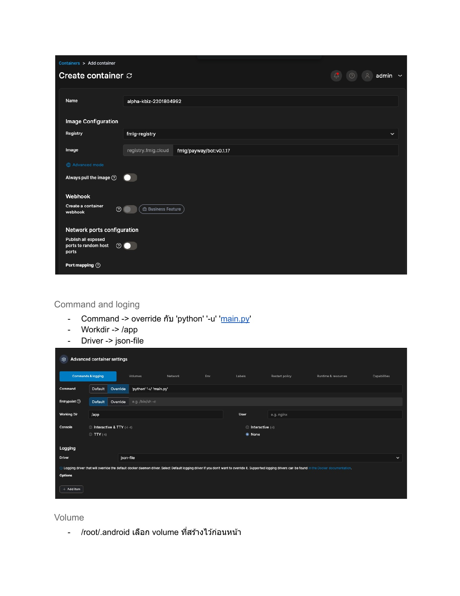

3. **Command and logging**: Command override เป็น `python -u main.py`, Workdir `/app`, Driver `json-file`
4. **Volume**: mount `/root/.android` ไปยัง volume ที่สร้างไว้ก่อนหน้า — **ถ้าเครื่อง host เป็น Windows** ให้เพิ่ม mount `/root/c` (Bind) → `/run/desktop/mnt/host/c` ด้วย
5. **Env** (advanced mode → copy ไปวาง):

    ```
    ADB_DEVICE=<ip:port ที่ pinkman ให้ — เอามือถือเสียบคอม(Windows)/กล่องดำ>
    BOT_NAME=kbiz
    DEVICE_TOKEN=<เอามาจากตอนสร้าง bot>
    INTERVAL=30
    PIN=<จากข้อมูลที่เจ้าของบัญชีให้>
    RETRY_COUNT=3
    URL_ENDPOINT=https://bank-adapter-api.payways.io/
    PATH=/usr/local/bin:/usr/local/sbin:/usr/local/bin:/usr/sbin:/usr/bin:/sbin:/bin
    GPG_KEY=7169605F62C751356D054A26A821E680E5FA6305
    PYTHON_VERSION=3.13.7
    PYTHON_SHA256=5462f9099dfd30e238def83c71d91897d8caa5ff6ebc7a50f14d4802cdaaa79a
    WAITING_TIME=12
    ```

    !!! note "GPG_KEY/PYTHON_VERSION/PYTHON_SHA256 ไม่ใช่ secret ของระบบเรา"
        ค่าพวกนี้เป็นค่ามาตรฐานของ **official Python Docker base image** (ใช้ verify ตัวติดตั้ง Python) ไม่ใช่ credential ของบัญชีธนาคาร/ระบบเรา — ค่าที่เป็น secret จริงในบล็อกนี้มีแค่ `ADB_DEVICE`, `DEVICE_TOKEN`, `PIN`

6. **Restart Policy**: เลือก **Unless stopped**
7. กด **Deploy the container**

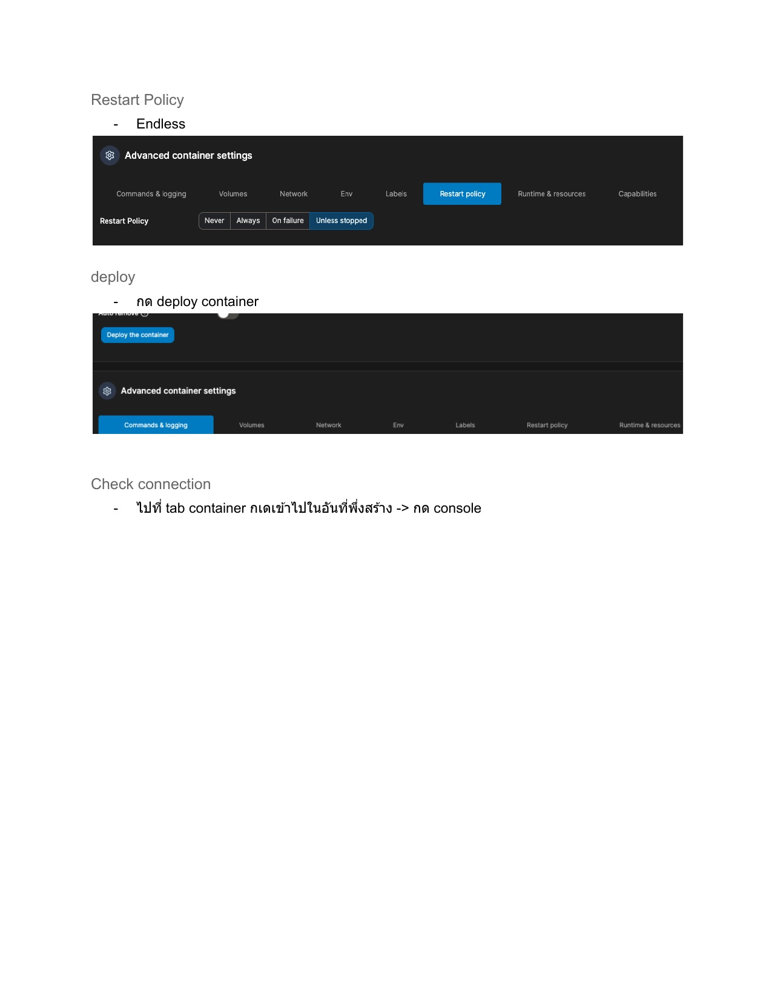

### ขั้นที่ 4 — เช็คการเชื่อมต่อ

ไปที่ tab Container → เข้าไปในอันที่เพิ่งสร้าง (สถานะ **running**) → กด **Console**

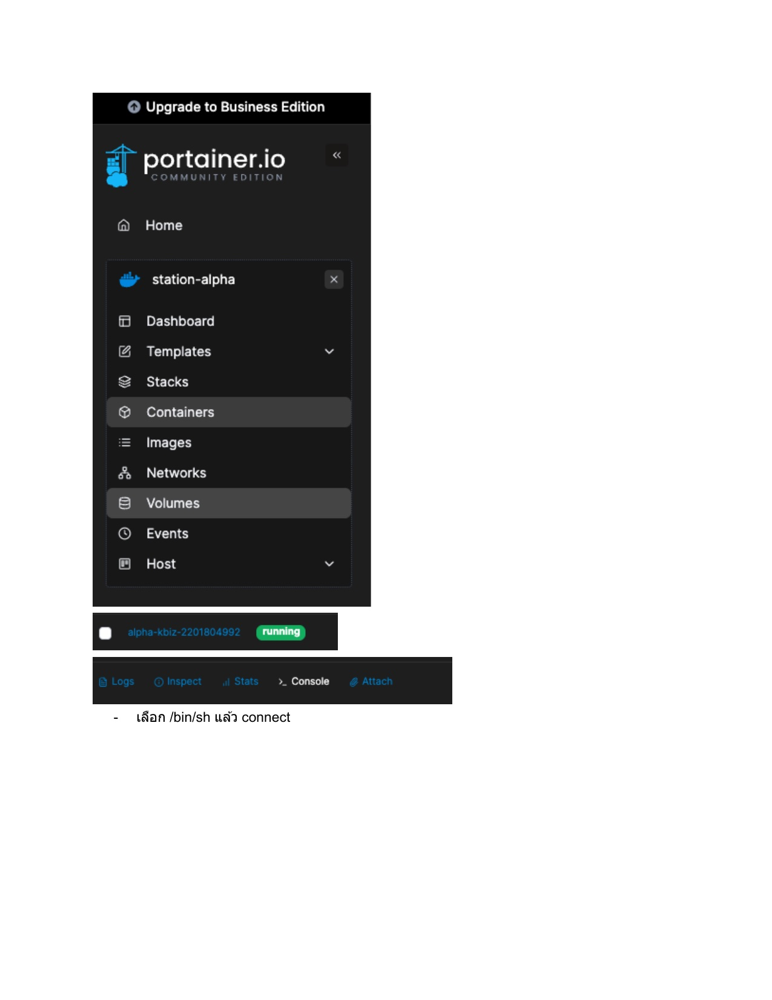

เลือก `/bin/sh` (หรือ `/bin/bash`) → Connect → พิมพ์ `adb connect <ip:port>` ตาม IP ที่ setup ไว้ใน ENV — ควรได้ผลลัพธ์ `already connected to <ip:port>`

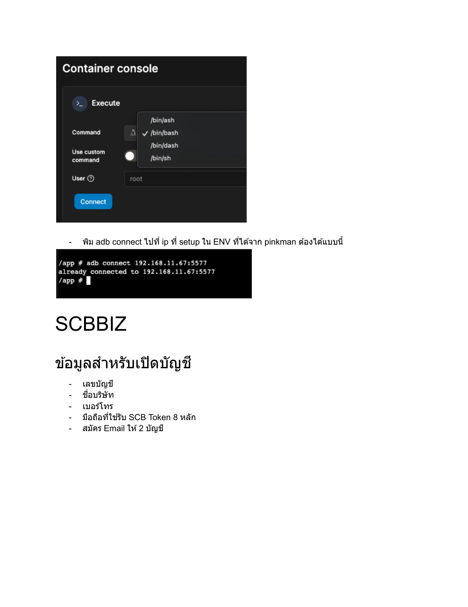

## SCBBIZ

([scbbusinessanywhere.com](https://www.scbbusinessanywhere.com/))

**ข้อมูลที่ต้องขอ:** เลขบัญชี, ชื่อบริษัท, เบอร์โทร, มือถือที่ใช้รับ SCB Token 8 หลัก, สมัคร Email ให้ **2 บัญชี** (Maker คนหนึ่ง Checker คนหนึ่ง)

**ต้องมีก่อนเริ่ม:**

- User สิทธิ์ Maker (Username/Password เว็บ SCBBIZ) + User สิทธิ์ Checker (Username/Password เว็บ SCBBIZ)
- Email ที่ผูกกับ User สิทธิ์ Checker (Username/Password/App Password)
- Email ที่ผูกกับ User สิทธิ์ Maker (Username/Password)

### ขั้นที่ 1-2 — เตรียม Gmail สำหรับ Maker และ Checker

ขอให้เจ้าของบัญชีสร้าง Gmail เพิ่ม 2 บัญชี (เลือกอันหนึ่งเป็น Maker อีกอันเป็น Checker) ผูกเบอร์กับเบอร์มือถือของบัญชี แล้ว**เปิด 2FA**

=== "เปิด 2-Step Verification"
    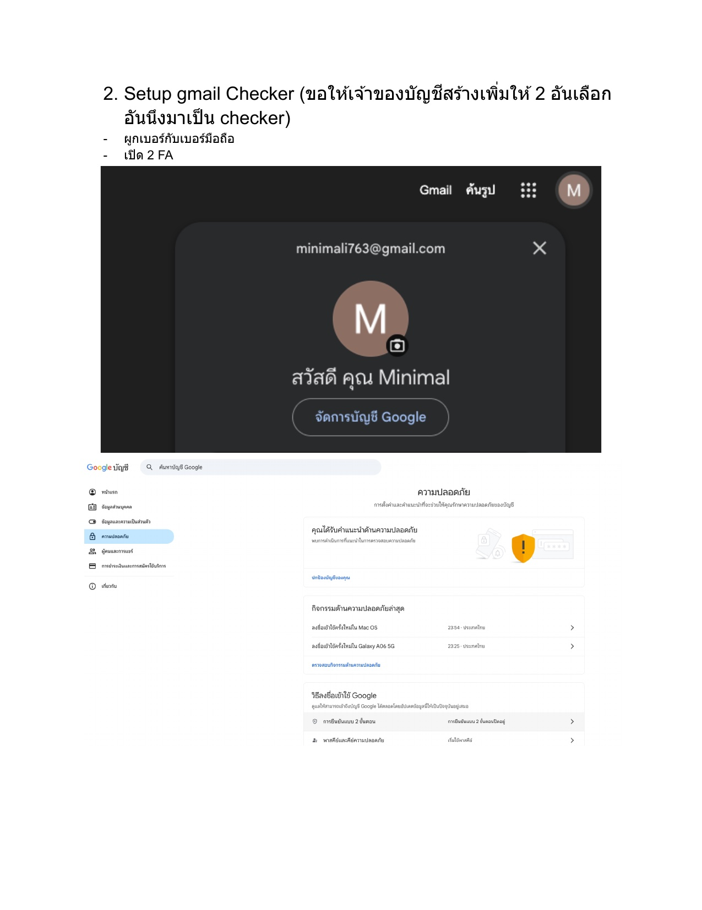
=== "หน้า Security"
    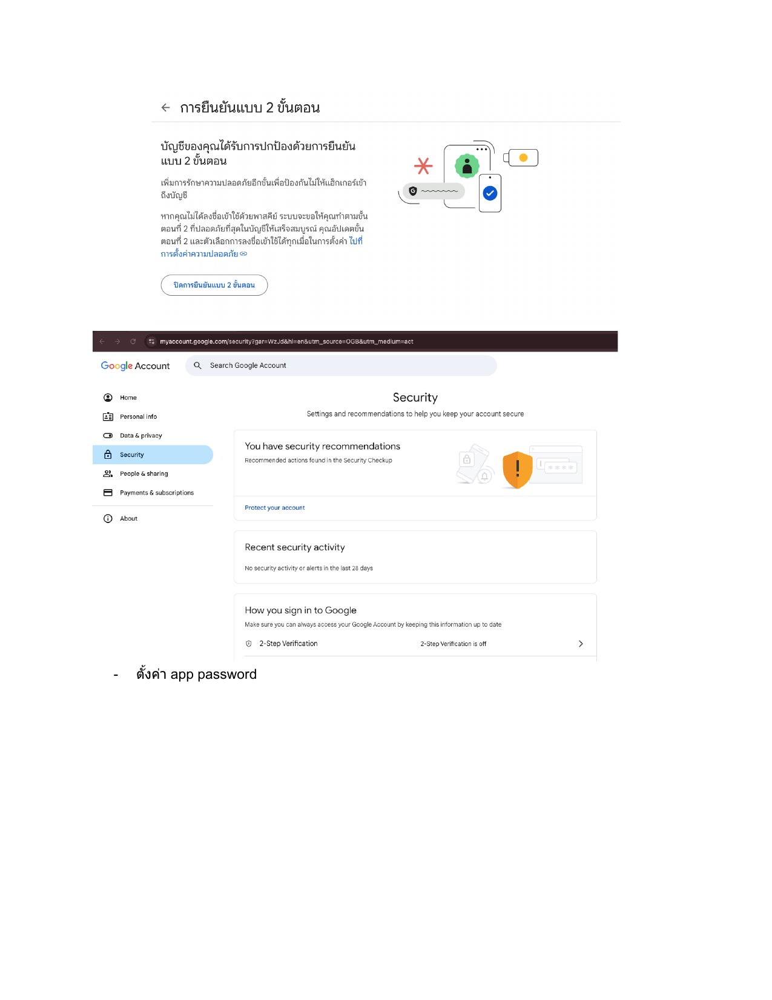

จากนั้นสร้าง **App Password** (ค้นหา "รหัสผ่านสำหรับแอป" ในเมนู Google Account) ตั้งชื่อ `scbbiz` แล้วเก็บ App Password ไว้

=== "ค้นหา App Password"
    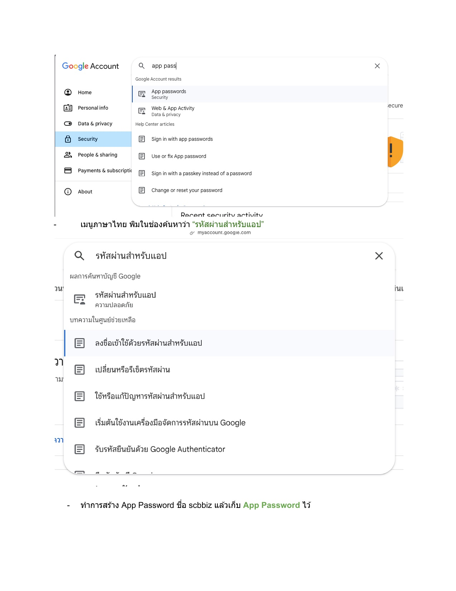
=== "รายการ App Password"
    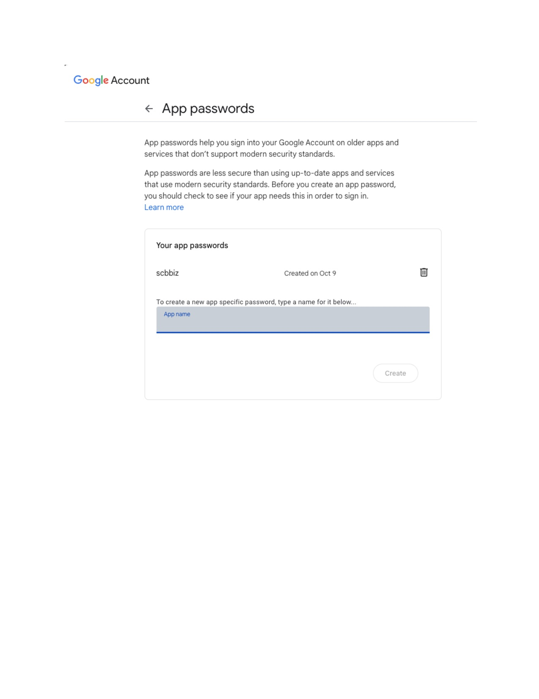

### ขั้นที่ 3 — ตั้งค่าบัญชี SCBBIZ

สลับเป็น **โหมด Admin** (มุมขวาบน) → **จัดการข้อมูลบริษัทและผู้ใช้งาน** → **ข้อมูลผู้ใช้งานและสิทธิ์ผู้ใช้งานบัญชี** → **เพิ่มผู้ใช้งานใหม่**

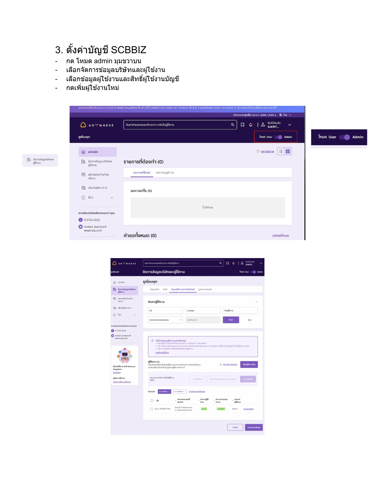

**เพิ่มผู้ใช้งาน 2 คน** — เตรียม: เอกสารแสดงตัวตน (บัตรประชาชน), Email ที่เตรียมไว้ในขั้นที่ 1-2, เบอร์ที่ใช้คือเบอร์มือถือของบัญชี, ยืนยันด้วย OTP ผ่าน SMS หรือ Email แล้วกดบันทึก

=== "ฟอร์มเพิ่มผู้ใช้งาน (ส่วนบน)"
    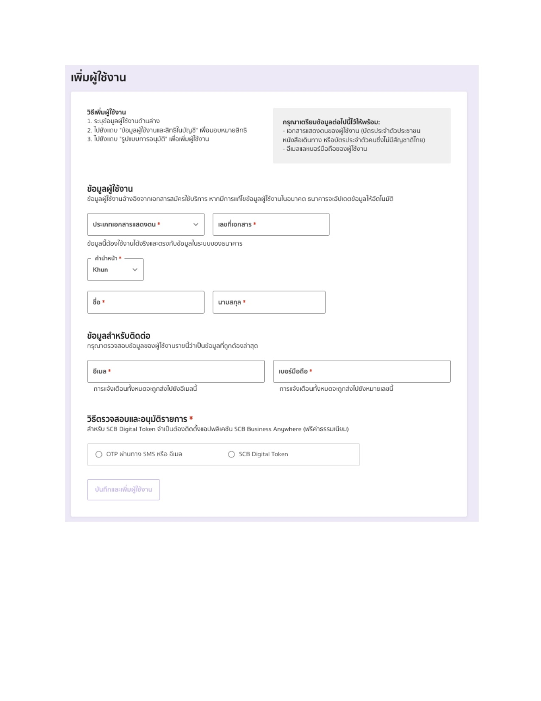
=== "ฟอร์มเพิ่มผู้ใช้งาน (สรุป)"
    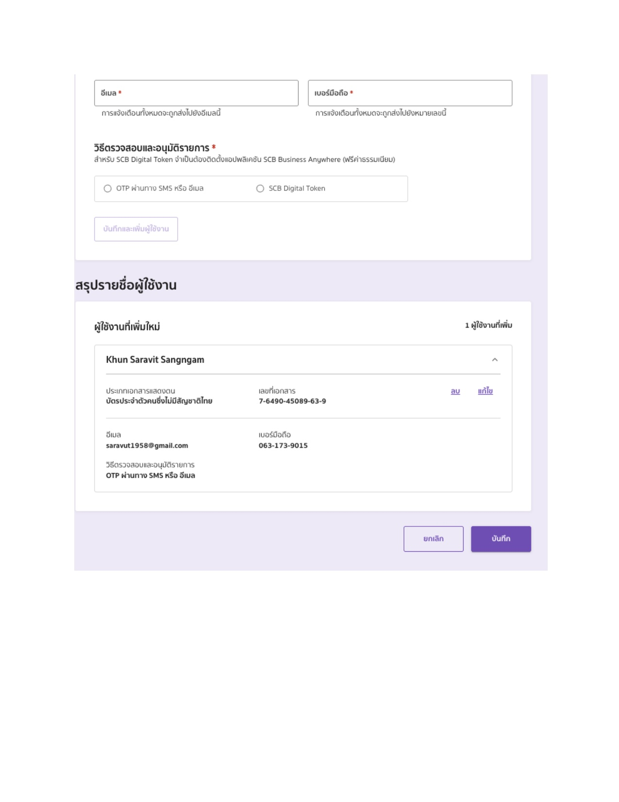
=== "เพิ่มครบ 2 คน"
    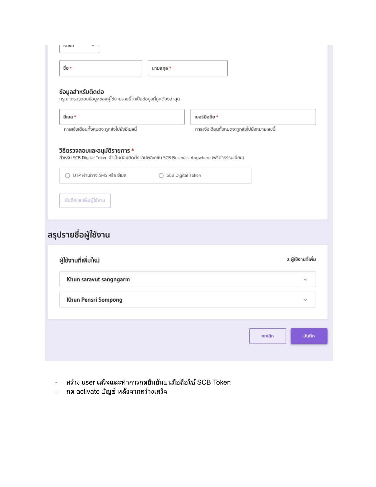

หลังสร้าง user เสร็จ ต้องกดยืนยันบนมือถือด้วย **SCB Token** แล้ว admin กด **activate** บัญชีหลังจากสร้างเสร็จ

จากนั้นกำหนด **สิทธิ์เพิ่มเติม** (เช่น การ import file, การดาวน์โหลดรายงาน ฯลฯ) และ **สิทธิ์พื้นฐานในบัญชี** (เลือกบัญชีธนาคารที่ user คนนี้เข้าถึงได้)

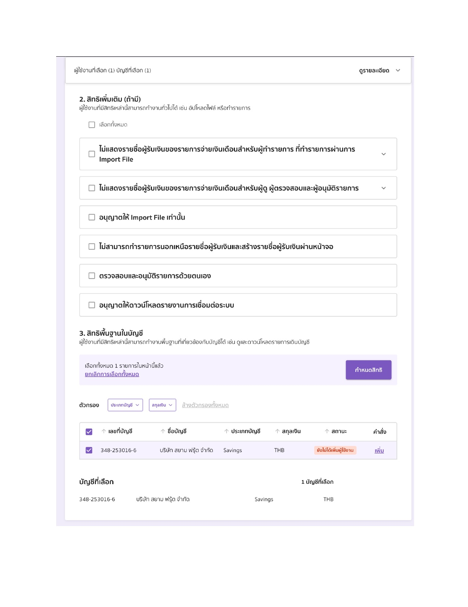

ตรวจสอบสถานะผู้ใช้งานได้ที่หน้ารายละเอียด (สถานะ **Active** เมื่อ activate สำเร็จ)

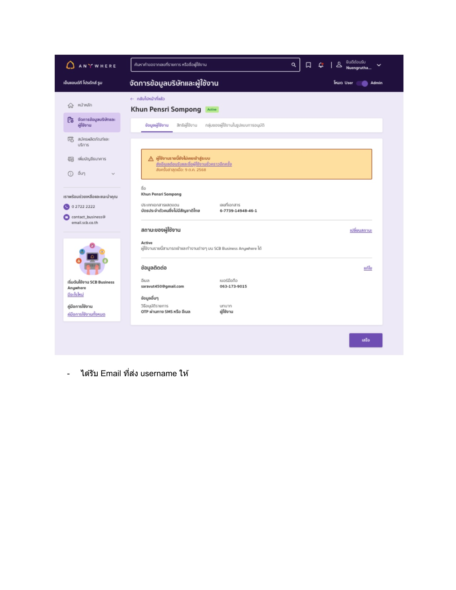

ผู้ใช้จะได้รับ email "SCB Business Anywhere: Getting Started" พร้อม username ชั่วคราว → นำไป login แล้วระบบให้ตั้ง username/password ใหม่ (แนะนำตั้งชื่อแบบ `<ชื่อ>maker` ให้จำง่าย)

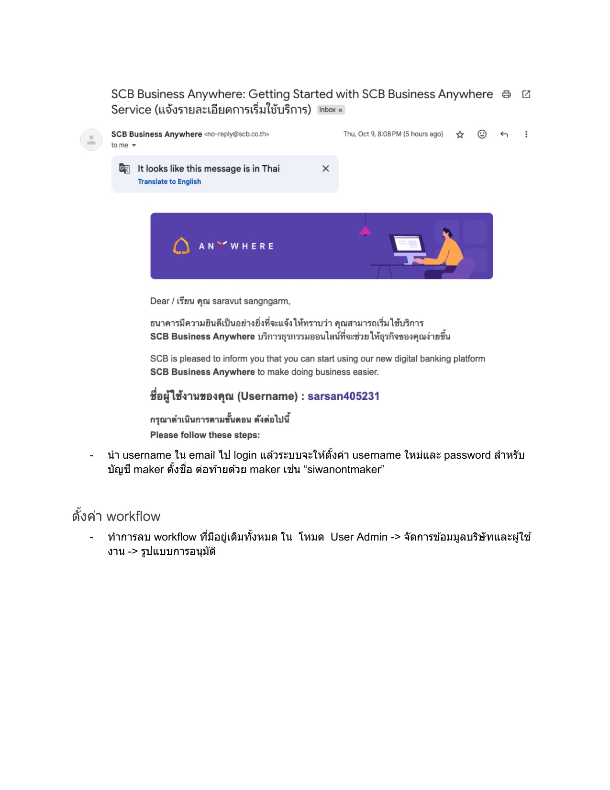

### ขั้นที่ 4 — ตั้งค่า Workflow (Maker/Checker)

ก่อนสร้างใหม่ ต้อง**ลบ workflow ที่มีอยู่เดิมทั้งหมดก่อน** — ในโหมด Admin: **จัดการข้อมูลบริษัทและผู้ใช้งาน → รูปแบบการอนุมัติ**

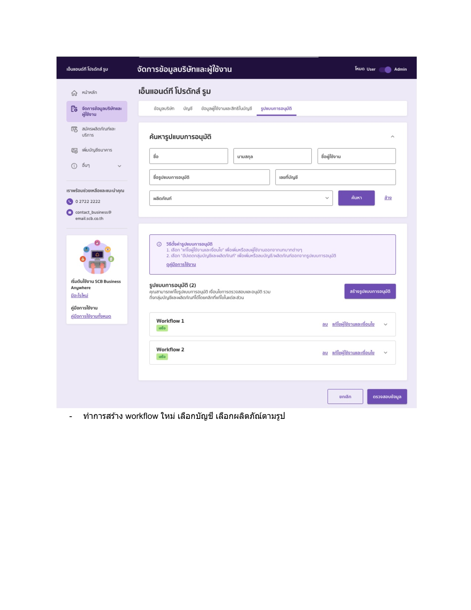

สร้างใหม่: เลือกบัญชี → เลือกบริการที่อนุญาต (ตัวอย่างที่เห็น: **บริการโอนเงินระหว่างบัญชีตัวเอง, บริการโอนเงินให้บุคคลอื่นในธนาคาร, บริการโอนเงินบุคคลอื่นต่างธนาคาร, บริการพร้อมเพย์** — ไม่รวม Payroll/Bill Payment/e-Payment/Cheque Management)

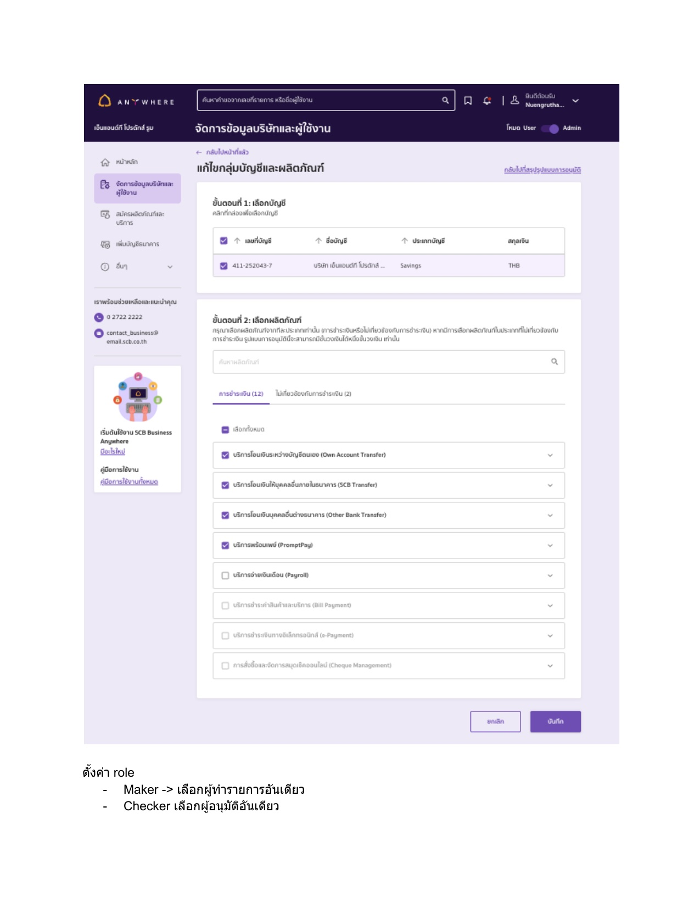

ตั้งค่า role: **Maker** = เลือกผู้ทำรายการอันเดียว, **Checker** = เลือกผู้อนุมัติอันเดียว แล้วกดยืนยันผ่านมือถือด้วย SCB Token

 ใครเป็นผู้อนุมัติ (Checker)")

## ตัวอย่างจริงที่เคยผูกสำเร็จ

!!! note "ส่วนนี้เป็นบันทึกเคสจริง ไม่ใช่ SOP ทั่วไป"
    ต่างจากเนื้อหาด้านบนตรงที่เป็นข้อมูลบัญชีจริงที่เคย onboard สำเร็จแล้ว เก็บไว้เป็นตัวอย่างอ้างอิง

### KTB + KBIZ — บริษัท GlobeLink Logistics / เน็กซ์เทรด.แอล

**KTB Bank** — เลขที่บัญชี `0170557855`, PIN `20xxxx`, KTB company ID `SSKBA0xxxx`, Username `USER01`, password `Globelink2xxxx`, PromptPay `0105568099943`

**KBiz** — บริษัท เน็กซ์เทรด.แอล จำกัด, เลขบัญชี `2241387162` (ออมทรัพย์), เบอร์โทร `0638289252`, Username แอป KBIZ `Nextrade01`, Password แอป KBIZ `Nextrade2xxxx`

!!! tip "ข้อจำกัดวงเงิน KBiz ก่อน/หลังเพิ่มผู้ใช้งาน"
    บันทึกไว้ว่า ณ ตอนนั้นมือถือ/PIN เข้า KBiz ยัง "รอเพิ่มผู้ใช้งาน" ทำให้วงเงินได้ไม่เกิน **2 ล้านบาท/วัน** — แต่ถ้าเพิ่มผู้ใช้งานแล้วย้ายไปใช้ผ่าน KBiz Application จะขยายวงเงินเป็น **5 ล้านบาท/วัน**

### SCBBIZ — บริษัท วอลการ์ด จำกัด

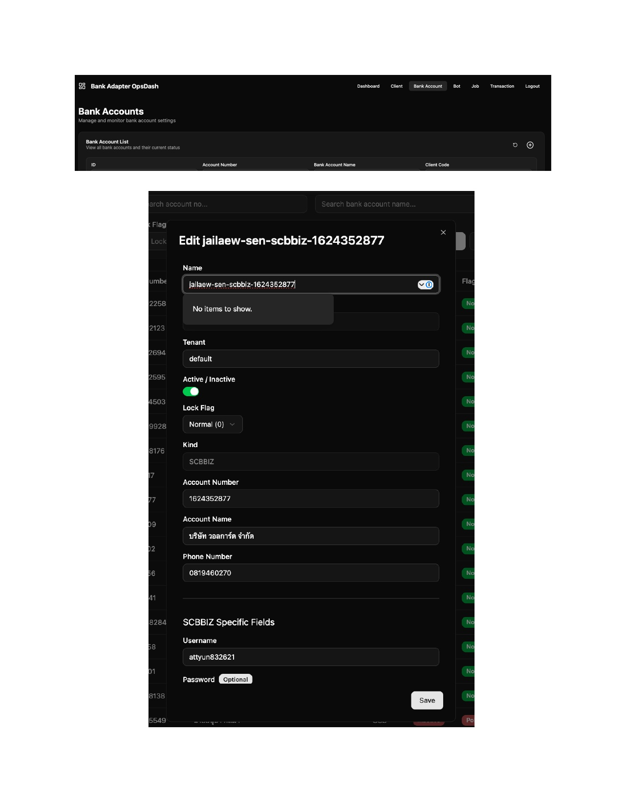

### KBIZ — บริษัท แสพเว่น จำกัด

ตัวอย่างการส่งข้อมูล setup ผ่านห้อง Telegram จากทีม "Pinkman" — มี setup URL ที่ผูก token เฉพาะของบัญชีนั้นมาให้เลย

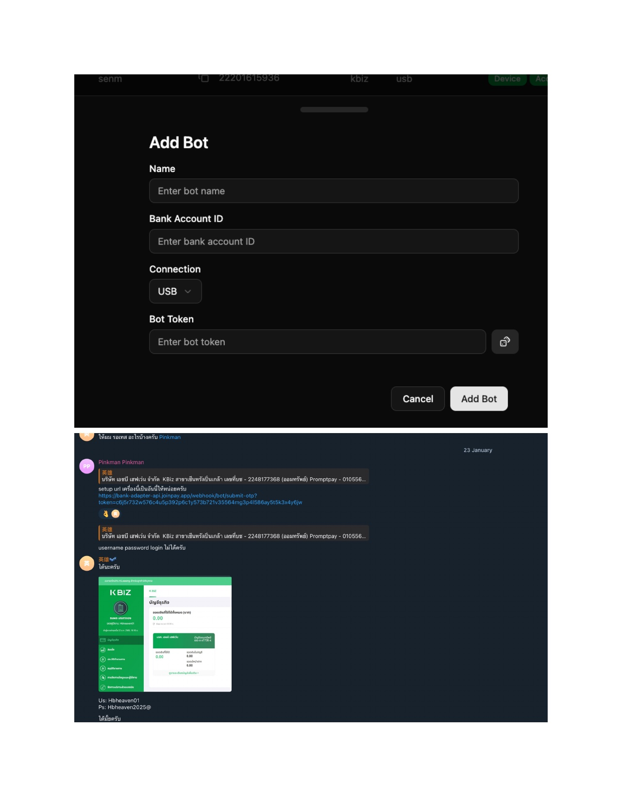

## เชื่อมโยงกับส่วนอื่นของคู่มือ

| หัวข้อ | ลิงก์ |
|---|---|
| หน้าจอ Bank Account ฝั่ง Admin/monitoring | [OpsDash → Bank Account](bank-accounts.md) |
| หน้า Onboard (staging ก่อนเป็นบัญชีจริง) — SOP นี้ข้ามการ staging ไปสร้างบัญชีตรงเลย | [OpsDash → Onboard](onboard.md) |
| Bot / Job ที่รันงานให้บัญชี KBIZ | [OpsDash → Bot](bots.md), [OpsDash → Job](jobs.md) |
| เลเยอร์อุปกรณ์/บอทเต็มรูปแบบ | [PGWay — ภาพรวม](../pgway/index.md) |

!!! question "คำถามค้างใหม่จาก SOP นี้"
    - "pinkman" คือทีม/บุคคลที่ดูแล IP อุปกรณ์และการ setup อุปกรณ์จริง — เป็น role/ทีมแยกจาก "PM"/"TS" ที่เจอในฝั่ง Support หรือเป็นคนเดียวกัน?
    - SOP นี้ไม่ผ่านหน้า [Onboard (staging)](onboard.md) เลย — สร้างบัญชีตรงในฟอร์ม "Add New Bank Account" ทันที ต่างจากที่เคยตั้งสมมติฐานไว้ว่า credential ดิบต้องผ่าน staging ก่อนเสมอ — คาดว่า staging flow อาจสงวนไว้สำหรับกรณีอื่น (เช่น client "onboarder" ที่ไม่มีสิทธิ์สร้างบัญชีจริงตรงๆ) ยังไม่ยืนยัน 100%
