# Playbook แก้ปัญหาแบบ step-by-step

หน้านี้ต่างจาก [เคสที่พบบ่อย](common-cases.md) ตรงที่ [เคสที่พบบ่อย](common-cases.md) เป็นการ**วิเคราะห์ย้อนหลัง**เคสจริงที่เกิดขึ้นแล้ว ส่วนหน้านี้เป็น **playbook ที่ทีม Support เขียนไว้ล่วงหน้า** ให้ทำตามได้ทันทีเมื่อเจอปัญหาแบบเดิมซ้ำ — มาจากเอกสาร SOP ภายในชื่อ "Support Guideline" แบ่งเป็นเคสตามรหัส (SCG-1, SCG-2, ...)

!!! danger "คำว่า 'PGWay' ในเอกสารต้นฉบับนี้ **ไม่ใช่** [PGWay (Device Monitoring)](../pgway/index.md) ที่เคยทำเอกสารไว้"
    เอกสารต้นฉบับตั้งชื่อหัวข้อว่า "Support Guideline for **PGWay**" แต่จากภาพหน้าจอที่แนบมา (ตาราง ID/Client/Tenant/Type/State/From/To/Amount/Date/Actions พร้อมปุ่ม **Resend Webhook**) — นี่คือหน้าตาของ **[OpsDash → Transaction](../opsdash/transactions.md) / Bank Adapter** ไม่ใช่ระบบ PGWay ที่บริหารอุปกรณ์/บอทมือถือที่เคยสำรวจไว้ก่อนหน้านี้เลย

    **คาดว่า** "PGWay" ในบริบทนี้เป็นชื่อเรียกรวมๆ ของฝั่ง "Bank Adapter" หรือชื่อ partner/instance หนึ่ง (คล้ายที่เคยเห็นคำว่า "PGWay" ถูกยกเป็นตัวอย่างชื่อ PGW Provider ใน [PGW API → Roles & Hierarchy](../api/roles.md)) ไม่ใช่ตัวสินค้า "PGWay" ที่มีหน้า Dashboard/Devices/Test Logs — ในหน้านี้จะเรียกว่า **"ฝั่ง Bank Adapter"** แทนเพื่อไม่ให้สับสนกับ [PGWay — ภาพรวม](../pgway/index.md)

## ฝั่ง Bank Adapter — เคสถอนเงิน/รายการหาย

### เคส: ถอนเงินไม่สำเร็จ (status = Failed)

เจอรายการถอนที่สถานะเป็น **Failed** บนฝั่ง Bank Adapter ให้ไปเช็ค Error Message

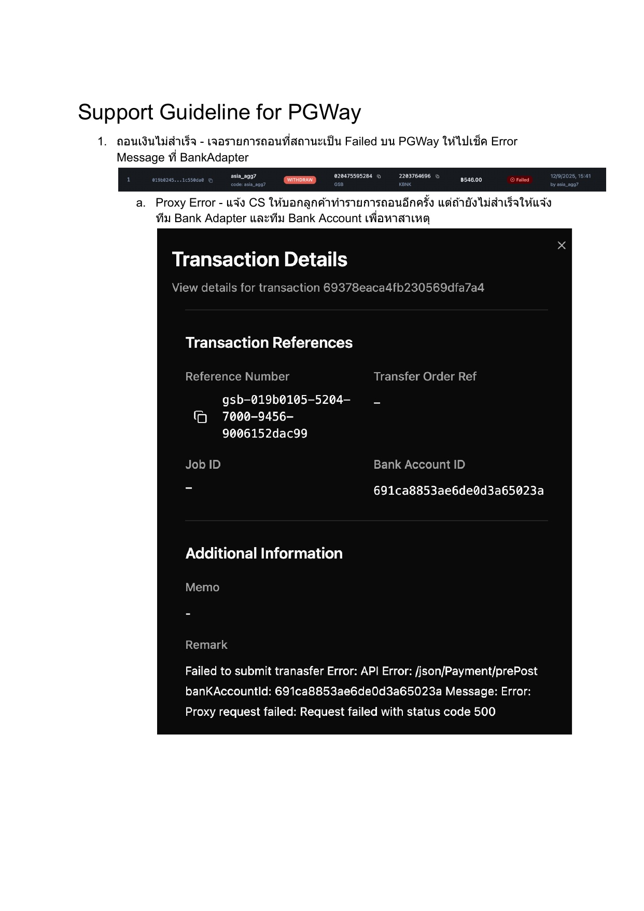

แยก 3 สาเหตุตาม Error Message ใน **Remark** ของ Transaction Details:

=== "Proxy Error"
    Remark: `Failed to submit transfer Error: API Error: /json/Payment/prePost ... Message: Error: Proxy request failed: Request failed with status code 500`

    ")

    **วิธีแก้:** แจ้ง CS ให้บอกลูกค้าทำรายการถอนอีกครั้ง — ถ้ายังไม่สำเร็จให้แจ้งทีม **Bank Adapter** และทีม **Bank Account** เพื่อหาสาเหตุ

=== "Bank Error"
    Remark: `...Message: ทำรายการไม่สำเร็จ กรุณาตรวจสอบประวัติการทำรายการก่อนการทำรายการซ้ำใหม่อีกครั้ง (E:093:0001)`

    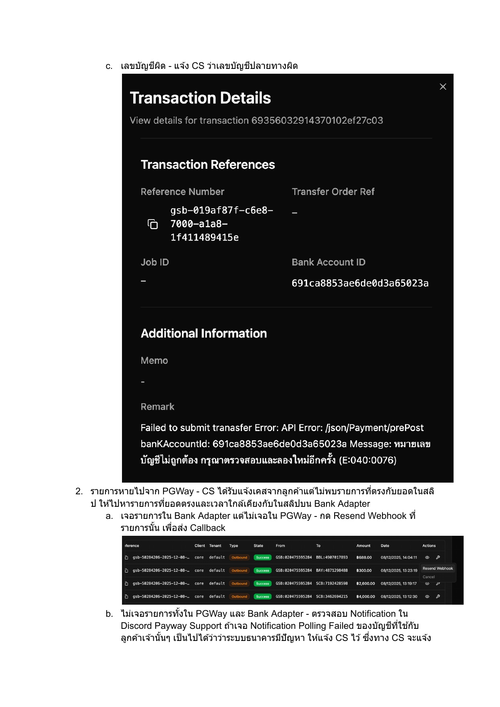

    **วิธีแก้:** เหมือน Proxy Error — ให้ลูกค้าลองใหม่ก่อน ไม่สำเร็จค่อย escalate

=== "เลขบัญชีผิด"
    Remark: `...Message: หมายเลขบัญชีไม่ถูกต้อง กรุณาตรวจสอบและลองใหม่อีกครั้ง (E:040:0076)`

    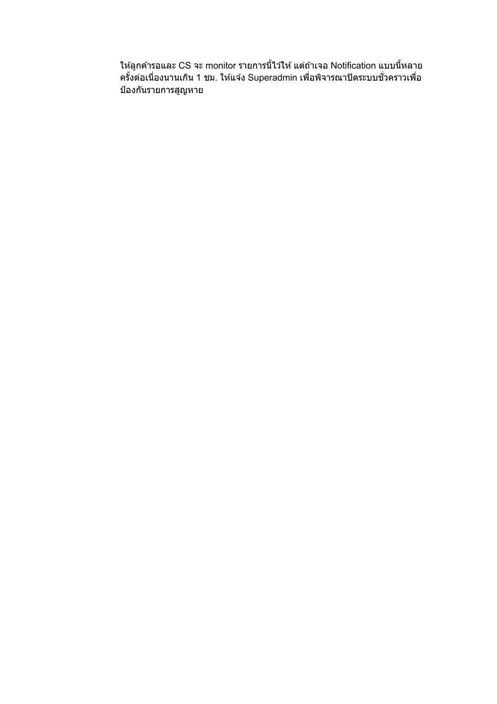

    **วิธีแก้:** แจ้ง CS ว่าเลขบัญชีปลายทางผิด (ไม่ต้อง escalate ต่อ — เป็นความผิดพลาดฝั่งลูกค้ากรอกเลขบัญชี)

!!! tip "Job ID ว่างเปล่า = job ไม่เคยถูก dispatch"
    ทั้ง 3 ตัวอย่างมี **Job ID เป็น `-`** สอดคล้องกับที่เคยสรุปไว้ใน [OpsDash → Job](../opsdash/jobs.md) ว่า **"Created" = job ไม่เคยถูกแตะเลย** — กรณีนี้คือ error เกิดตั้งแต่ชั้น API/ธนาคารก่อนจะถึงขั้นตอนสร้าง job ด้วยซ้ำ

### เคส: รายการหายไปจากฝั่งเรา (ลูกค้าโอนมาแล้วแต่ไม่เจอในระบบ)

CS ได้รับแจ้งจากลูกค้าว่าไม่พบรายการที่ตรงกับยอดในสลิป → ให้ไปหารายการที่ยอดตรงและเวลาใกล้เคียงกับในสลิป**บน Bank Adapter โดยตรง** (ไม่ใช่หน้า Console)

=== "เจอใน Bank Adapter แต่ไม่เจอใน ระบบเรา"
    กด **Resend Webhook** ที่รายการนั้นเพื่อส่ง Callback ซ้ำ

    

=== "ไม่เจอทั้งฝั่ง Bank Adapter และระบบเรา"
    ตรวจสอบ Notification ใน **Discord ห้อง "Payway Support"** — ถ้าเจอ Notification **"Polling Failed"** ของบัญชีที่ใช้กับลูกค้าเจ้านั้นๆ เป็นไปได้ว่าระบบธนาคารมีปัญหา

    **ขั้นตอน:** แจ้ง CS ไว้ก่อน → CS จะให้ลูกค้ารอและ monitor รายการนี้ไว้ให้ → **ถ้าเจอ Notification แบบนี้หลายครั้งต่อเนื่องนานเกิน 1 ชม.** ให้แจ้ง **Superadmin** เพื่อพิจารณาปิดระบบชั่วคราวป้องกันรายการสูญหายเพิ่ม

    !!! danger "จุดยกระดับความรุนแรง (escalation threshold) ที่ชัดเจนที่สุดเท่าที่เคยเจอในเอกสารชุดนี้"
        "Polling Failed" ต่อเนื่อง **> 1 ชั่วโมง** คือเกณฑ์ตายตัวที่ทีม Support ใช้ตัดสินใจแจ้ง Superadmin พิจารณาปิดระบบชั่วคราว — เป็นคำตอบที่ชัดเจนกว่าที่เคยอนุมานไว้ในหน้าอื่นของคู่มือทั้งหมด

## ฝั่ง Console — [SCG-1] ฝากมาไม่ตรงยอด/ฝากไม่เข้า

ลูกค้าโอนเงินมาแล้วแต่ยอดไม่ตรงกับที่ระบบรอ หรือฝากไปแล้วไม่เข้าเครดิตเลย

### ขั้นตอน

1. **รับเคส** — เช็คว่าธนาคารที่ลูกค้าโอนมา ตรงกับที่ระบบรองรับไหม (ดูได้ที่ **Payment > Payment Channels**) ถ้าไม่มี ตอบกลับลูกค้าว่าไม่ใช่บัญชีในระบบ

    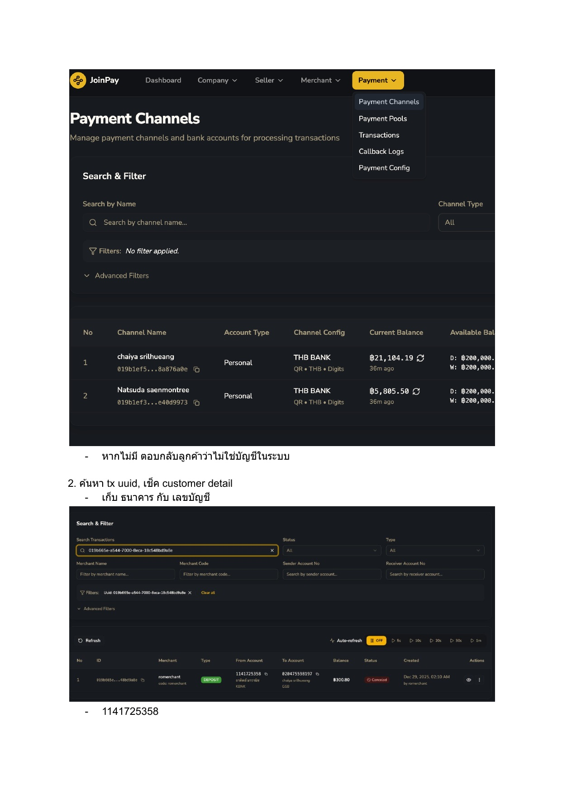

    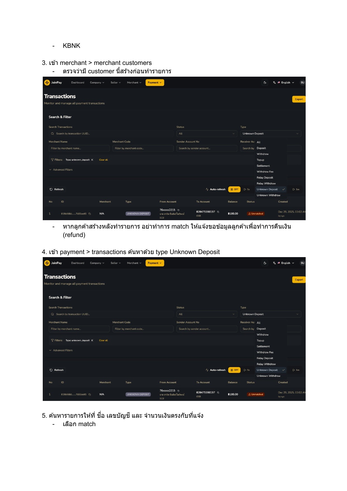

2. **ค้นหา tx uuid, เช็ค customer detail** — เก็บ ธนาคาร กับเลขบัญชีของลูกค้าไว้
3. **เข้า Merchant > Merchant Customers** — ตรวจว่ามี customer นี้ถูกสร้างไว้**ก่อน**ทำรายการหรือเปล่า

    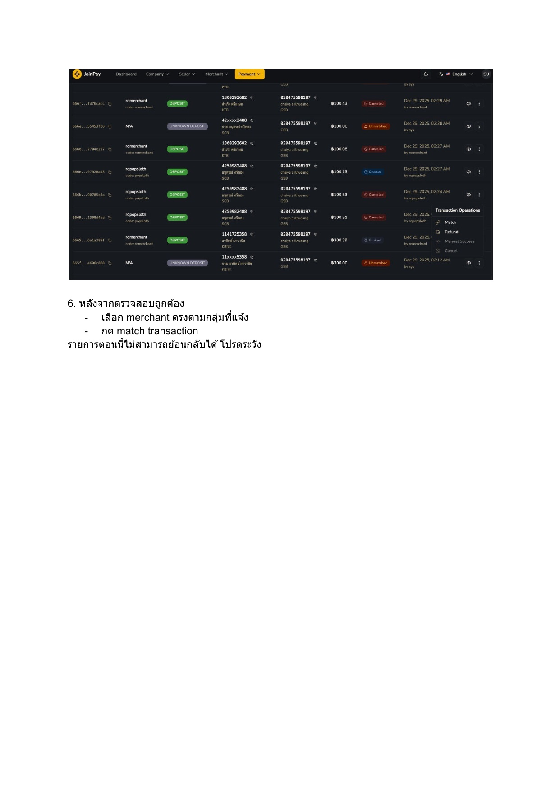

    !!! danger "จุดตัดสินใจสำคัญ — ถ้า customer สร้าง**หลัง**ทำรายการ ห้าม match"
        **ถ้าลูกค้าสร้าง record หลังทำรายการ อย่าทำการ match** ให้แจ้งข้อมูลลูกค้าเพื่อทำการ**คืนเงิน (refund)** แทน — เพราะแปลว่าตอนโอนเงินมา ระบบยังไม่รู้จัก customer คนนี้เลย การ match เข้ากับ merchant อาจผิดเจ้าของจริง

4. **เข้า Payment > Transactions ค้นหาด้วย Type = Unknown Deposit**

    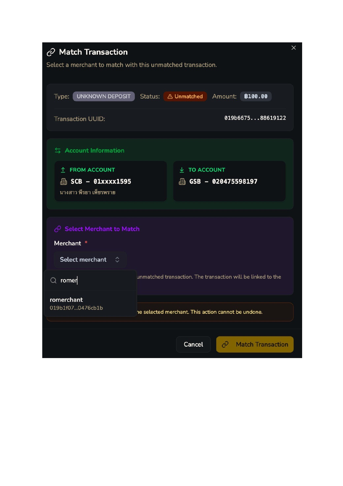

5. **ค้นหารายการที่ ชื่อ เลขบัญชี และจำนวนเงินตรงกับที่แจ้ง** แล้วเลือก **Match**

    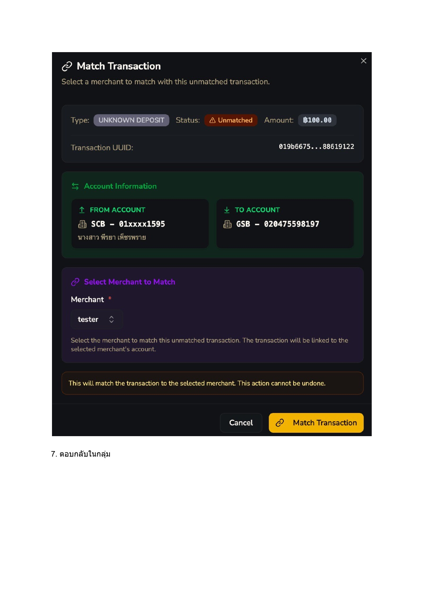

6. **หลังจากตรวจสอบถูกต้อง** — เลือก merchant ให้ตรงตามกลุ่มที่แจ้ง แล้วกด **Match Transaction**

    === "ค้นหา merchant"
        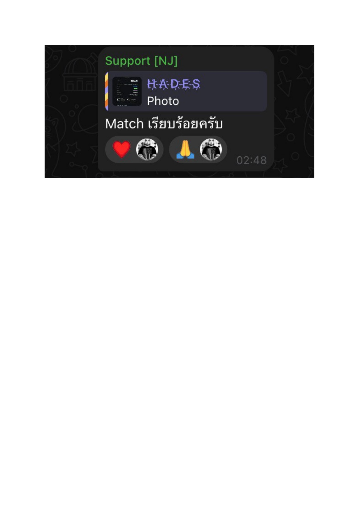
    === "ยืนยัน match"
        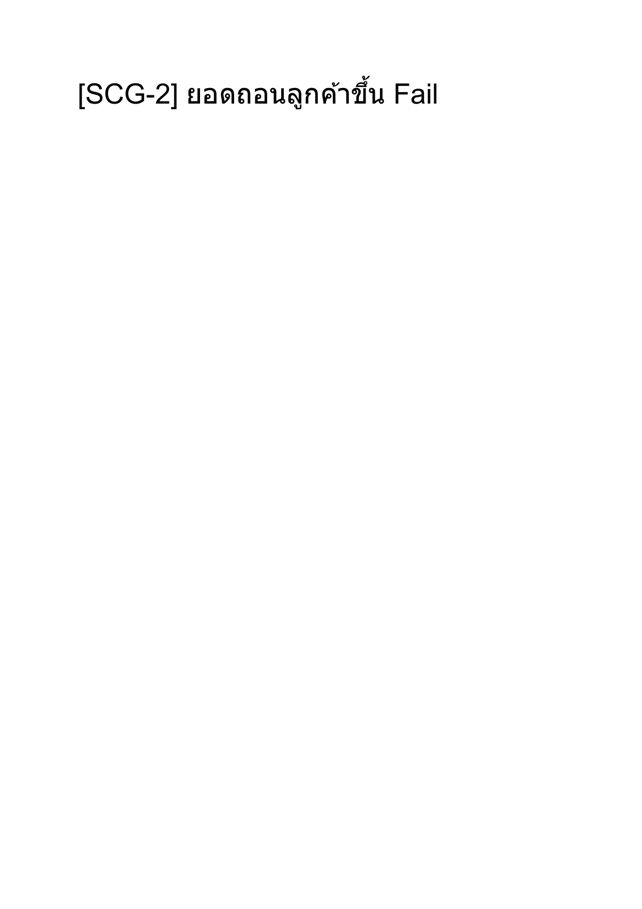

    !!! danger "รายการตอนนี้ไม่สามารถย้อนกลับได้ โปรดระวัง"
        คำเตือนนี้อยู่ในเอกสารต้นฉบับตรงๆ — การกด Match Transaction เป็น**การกระทำที่ย้อนกลับไม่ได้** ต้องมั่นใจว่าตรวจสอบครบทุกจุด (ชื่อ/เลขบัญชี/จำนวนเงิน/customer สร้างก่อนทำรายการ) ก่อนกดจริง

7. **ตอบกลับในกลุ่ม** — แจ้งลูกค้า/ร้านค้าว่า match เรียบร้อย

    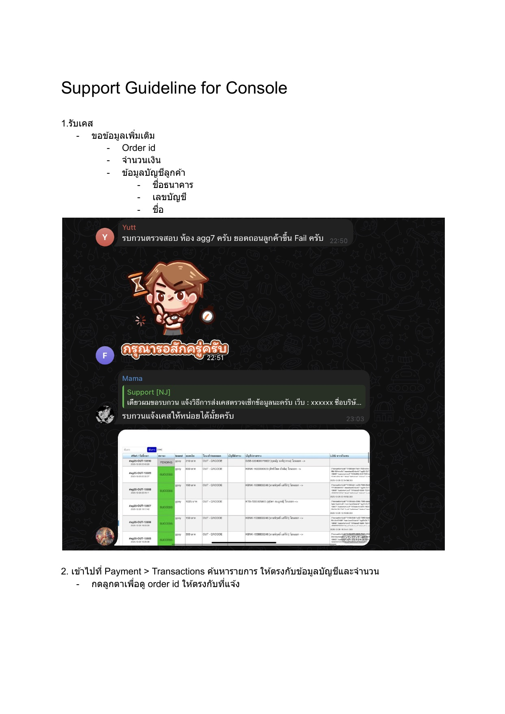

## ฝั่ง Console — [SCG-2] ยอดถอนลูกค้าขึ้น Fail

ร้านค้าแจ้งว่ารายการถอนของลูกค้าขึ้นสถานะ Fail ในระบบของร้านค้าเอง

### ขั้นตอน

1. **รับเคส** — ขอข้อมูลเพิ่มเติม: **Order id, จำนวนเงิน, ข้อมูลบัญชีลูกค้า** (ชื่อธนาคาร, เลขบัญชี, ชื่อ)

    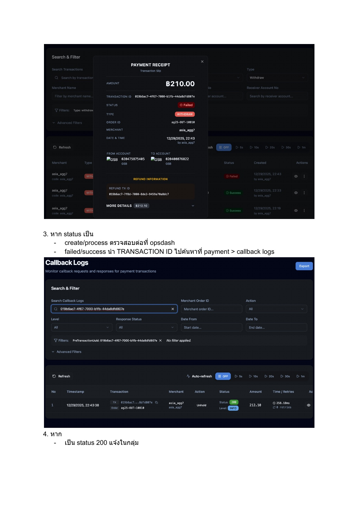

2. **เข้า Payment > Transactions ค้นหารายการให้ตรงกับข้อมูลบัญชีและจำนวน** — กดไอคอนตา (👁) เพื่อดู Order ID ให้ตรงกับที่แจ้ง

    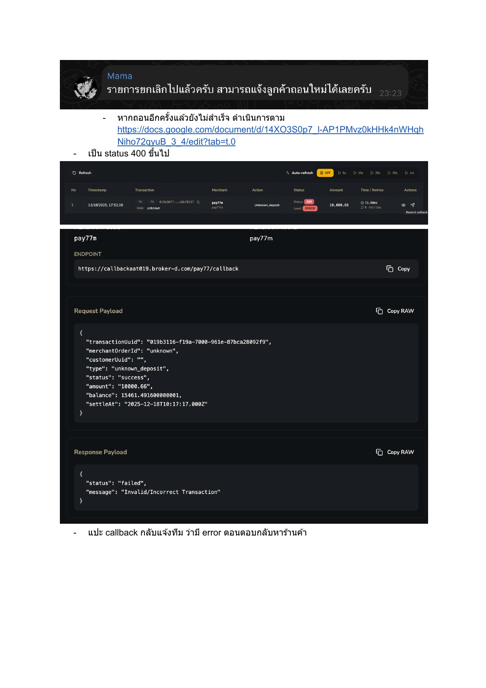

3. **ดู Status:**

    | Status | ทำอะไรต่อ |
    |---|---|
    | `create` / `process` | ตรวจสอบต่อที่ **OpsDash** |
    | `failed` / `success` | นำ **Transaction ID** ไปค้นหาที่ **Payment > Callback Logs** |

    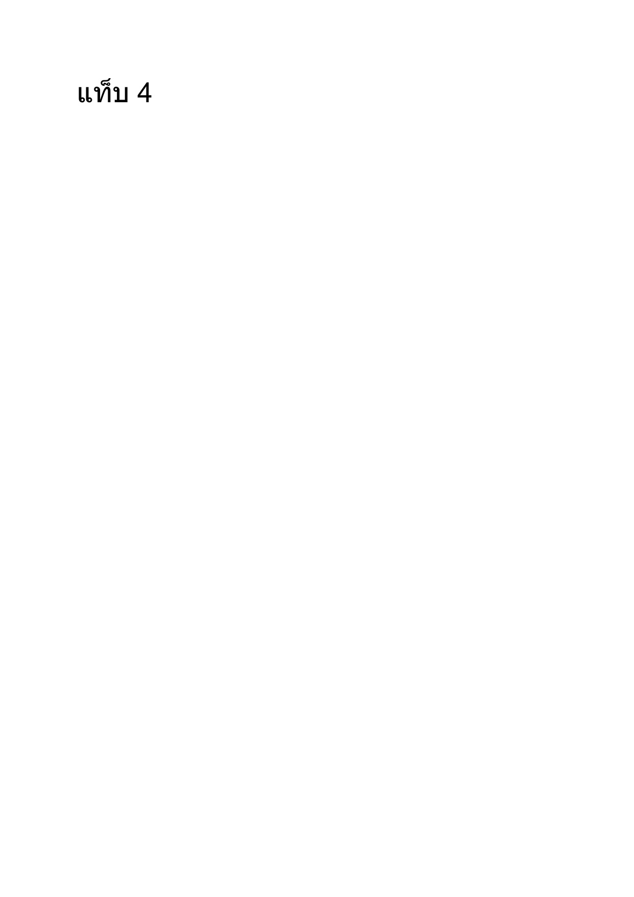

    !!! tip "Refund TX ID ใน Payment Receipt คือหลักฐาน unhold อัตโนมัติ"
        ตรงกับกลไกที่เคยยืนยันไว้ใน [Transaction Status Reference](status-reference.md) — withdraw ที่ fail จะมี transaction คู่ที่สร้างขึ้นมาเพื่อคืนเครดิตกลับ (`Refund TX ID`) เชื่อมกับ callback action **"Unhold"**

4. **ดูผลจาก Callback Logs:**

    === "Status 200"
        แจ้งในกลุ่มว่ารายการยกเลิกแล้ว สามารถแจ้งลูกค้าถอนใหม่ได้เลย

        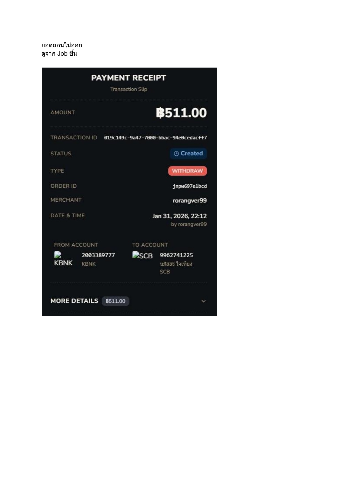

        ถ้าลูกค้าถอนอีกครั้งแล้วยังไม่สำเร็จ ให้ดำเนินการตาม [เอกสารขั้นตอนเพิ่มเติม (Google Docs)](https://docs.google.com/document/d/14XO3S0p7_l-AP1PMvz0kHHk4nWHqhNiho72qyuB_3_4/edit?tab=t.0)

    === "Status 400 ขึ้นไป"
        ตัวอย่างจริง — callback ประเภท `unknown_deposit` ได้ Response `{"status": "failed", "message": "Invalid/Incorrect Transaction"}` จาก endpoint ของร้านค้า (Level: **ERROR**, retries เพิ่มขึ้นเรื่อยๆ)

        **วิธีแก้:** แปะ callback (Request/Response Payload) กลับ แจ้งทีมว่ามี error ตอนตอบกลับหาร้านค้า — เป็นปัญหาฝั่ง endpoint ของร้านค้าเอง ไม่ใช่ฝั่งเรา

## เคสที่ยังไม่สมบูรณ์ในเอกสารต้นฉบับ

!!! question "'ยอดถอนไม่ออก ดูจาก Job ขึ้น' — เอกสารต้นฉบับตัดจบตรงนี้พอดี"
    หน้าสุดท้ายของเอกสารมีแค่หัวข้อ "ยอดถอนไม่ออก ดูจาก Job ขึ้น" พร้อมภาพตัวอย่าง Payment Receipt (Status: **Created**, KBNK → SCB) แต่ไม่มีขั้นตอนตามมาเลย — **คาดว่า**เอกสารต้นฉบับยังเขียนไม่เสร็จ ต้องตามคำตอบจากทีมพัฒนา/Support อีกที ว่าเคส "ค้าง Created แล้วดูจาก Job" ควรทำยังไงต่อ

## เชื่อมโยงกับส่วนอื่นของคู่มือ

| หัวข้อ | ลิงก์ |
|---|---|
| ความหมายของแต่ละ Status/Type รวม unhold | [Transaction Status Reference](status-reference.md) |
| หน้าจอ Transactions/Callback Logs ฝั่ง Console แบบละเอียด | [Console → Transactions](../console/payment/transactions.md), [Console → Callback Logs](../console/payment/callback-logs.md) |
| หน้าจอ Bank Adapter ฝั่ง OpsDash | [OpsDash → Transaction](../opsdash/transactions.md), [OpsDash → Bank Account](../opsdash/bank-accounts.md) |
| เคสจริงที่เคยวิเคราะห์แบบละเอียด | [เคสที่พบบ่อย](common-cases.md) |
